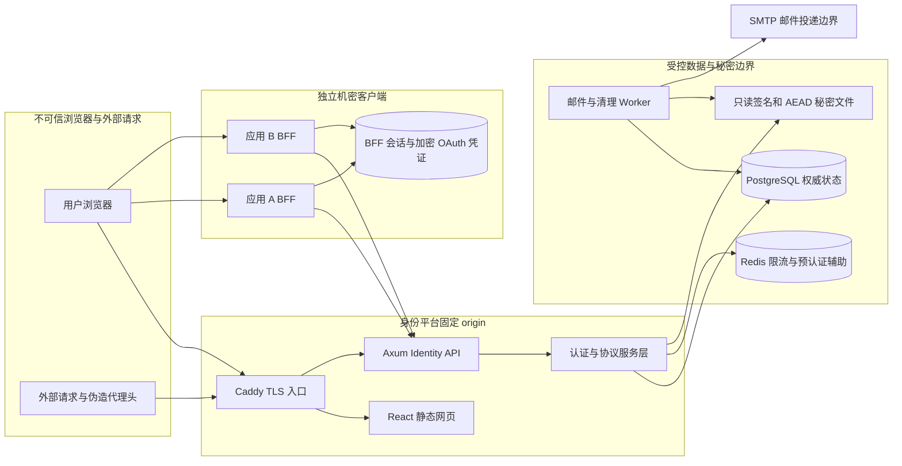
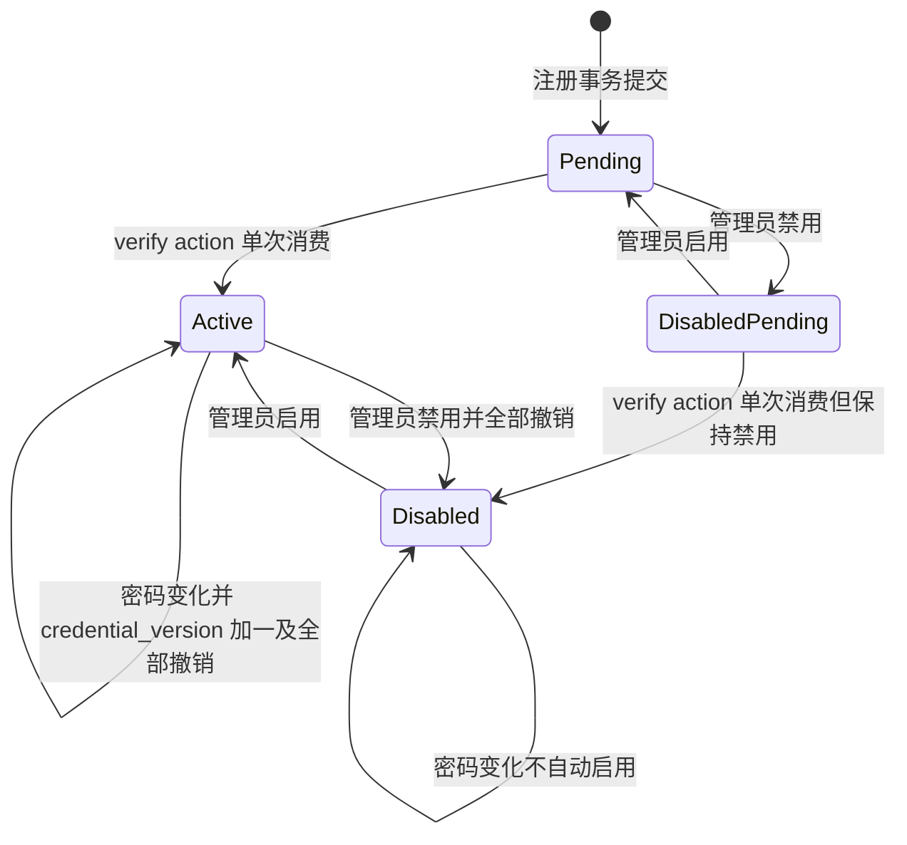
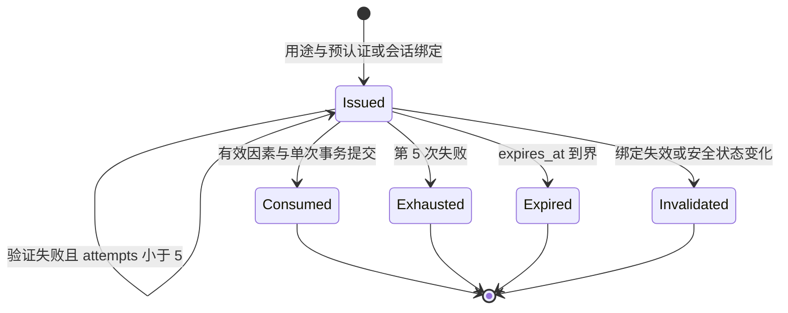
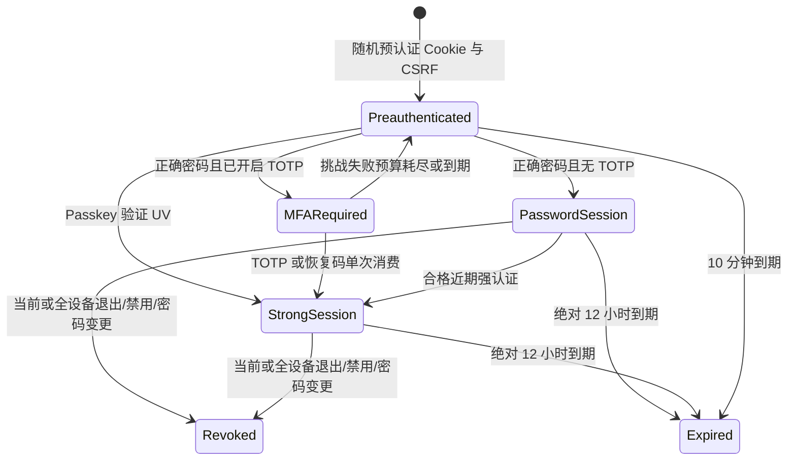
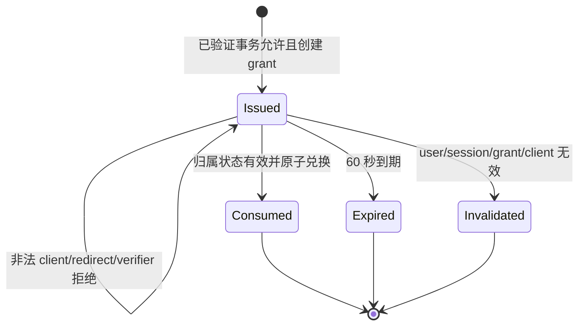
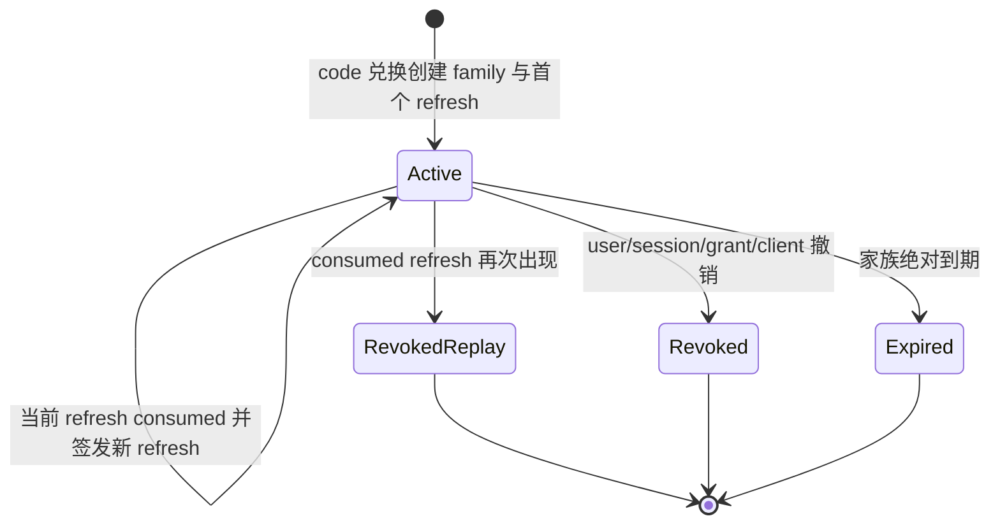
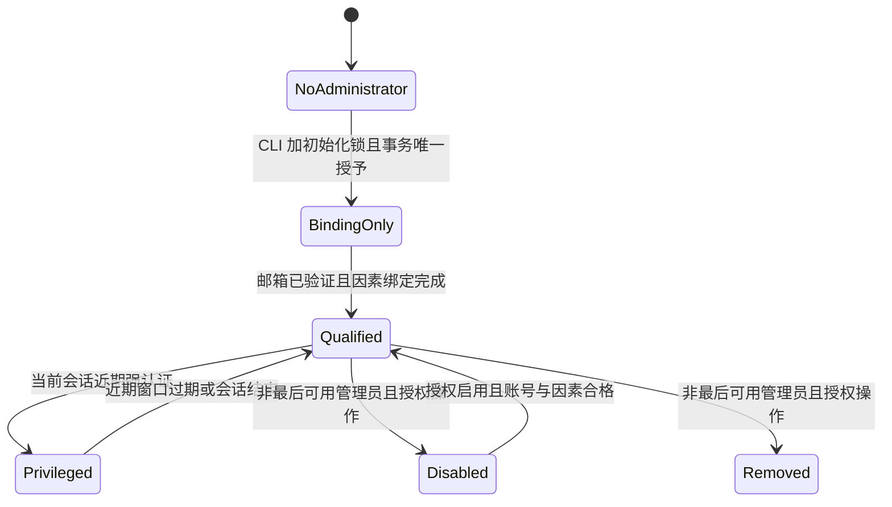

# 身份平台架构与认证状态契约

本文是 T02 的实现契约，描述 T03～T24 应实现的行为；不表示认证业务已经可用。接口请求、响应及错误分支以 [OpenAPI](api/openapi.yaml) 和 [计划第 4～7 节](../plan.md) 为准。规范实际访问记录见 [spec-sources.md](evidence/T02/spec-sources.md)，威胁与案例映射见 [threat-model.md](threat-model.md)。

## 组件与信任边界

| 边界 | 被信任的事实 | 必须验证的输入 |
|---|---|---|
| 浏览器→身份平台 | 无浏览器提供的身份、权限或 OAuth 事务参数可信 | 类型/长度、精确 Origin、CSRF、Cookie 摘要、服务端流程绑定、请求体上限 |
| Caddy→API | 仅显式 TRUSTED_PROXY_CIDRS 内的连接可以提供转发来源 | 其余 X-Forwarded-For/Forwarded 均忽略；issuer/RP/邮件基址固定，不从 Host 推导 |
| 服务层→PostgreSQL | users、sessions、grant、code/token/action/challenge 的已提交权威状态 | 参数化 SQL、统一行锁顺序、单次消费、归属与到期、必要审计同事务 |
| 服务层→Redis | 原子限流与预认证辅助状态 | Redis 不决定最终 MFA/WebAuthn 单次消费，不保存可绕过撤销的 active 正缓存 |
| Worker→SMTP | SMTP 投递结果只影响 outbox 重试状态 | 提交领取租约后发送；生产 TLS/证书校验；失败不撤回已提交安全变化 |
| 浏览器→BFF | 随机会话 Cookie；业务权限仍由该应用判断 | callback state/nonce/PKCE；身份状态每次 introspection；令牌不回传浏览器 |
| BFF→身份平台 | 认证客户端身份仅在 client_secret_basic 验证后成立 | token/code 的原 client、redirect、scope、session/grant/user 状态 |
| 数据库/备份→运维 | 数据库摘要不等于可用登录凭证 | TOTP、outbox 秘密参数与 BFF 长期凭证 AEAD；私钥独立受控备份；运行恢复演练 |

六个 Rust 包分别承担值对象/状态规则、SQLx 仓储事务、HTTP 输入输出、outbox/清理、受限管理 CLI、BFF。handler 不自行拆开一个安全动作的事务。React guard 只负责页面体验；每个 API 独立认证、校验权限与归属。

## 认证与令牌事实

用户 UUID 是稳定主体，OIDC sub 由服务端确定；邮箱只作为规范化唯一查询键，不作为主键。未验证或 disabled 用户不能创建普通会话、授权或新增 Passkey。

会话、OAuth code/access/refresh 至少 256 位随机熵，恢复码每个至少 128 位；数据库只存摘要。身份会话绝对 12 小时，预认证 10 分钟，授权事务 5 分钟，code 60 秒，access/ID Token 5 分钟，refresh 轮换且不超过其身份会话绝对到期。challenge 5 分钟，近期高风险认证窗口 5 分钟；verify action 30 分钟，reset action 15 分钟。

生产身份 Cookie 为 `__Host-identity`、Secure/HttpOnly/Path=/、SameSite=Lax、无 Domain；预认证 Cookie `__Host-identity-preauth` 同安全属性。开发分别使用 `identity-dev`、`identity-preauth-dev`，非 Secure 仅限本地允许环境。状态变化使用 `X-CSRF-Token` 并验证精确 Origin。浏览器不得将密码、code、OAuth token、验证码、恢复码写入 localStorage/sessionStorage/IndexedDB。邮件 token 置 fragment，页面立即清 URL，仅短期内存保存，明确按钮 POST 消费；GET 不能消费邮件动作、同意或退出。

## 有限状态机

这些状态是服务层约束；数据库可用字段组合表达状态，不能仅信任前端枚举。

### 账号

验证邮箱只是设置 verified，不自动取消 disabled；启用用户不复活旧 session/grant/token。密码验证在阻塞池完成后，登录事务再锁用户并核对 credential_version/verified/status，避免验证期间的禁用或密码变更穿透。

### 挑战与重新认证

purpose 是服务端固定的 login、reauthentication、totp_enrollment、passkey_registration、passkey_login、passkey_reauthentication 枚举，与 OpenAPI 一致。挑战不能跨用户/浏览器/session/用途复用。TOTP 验证原子更新 last_step，只允许当前及相邻一步且 step 大于 last_step；恢复码与挑战同事务消费；Passkey 由库校验 RP/origin/challenge/signature/UV 后同事务更新凭证状态与消费挑战。

### 身份会话

strong_at 是最近强因素验证时间，过 5 分钟后仍是有效登录会话但不满足高风险近期认证。登录成功随机轮换主 Cookie/CSRF，并在同一事务将当前合法授权事务升级绑定新 session；旧预认证绑定不能继续冒用。

### 授权码

code 摘要唯一，兑换锁同一权威状态，最多一次合法成功。授权事务先精确验证 client/redirect/scope/state/nonce/S256/prompt/max_age，再固定服务端参数；跨浏览器事务 ID 或重复 decision 不能生成授权码。未知回调错误停留身份域，已验证回调的标准协议错误带原 state。

### 刷新家族

每个已用 refresh 保存 consumed 摘要，直到家族绝对到期加 24 小时；重放撤销必须提交后返回 invalid_grant，不能随错误 rollback。每次只允许当前未消费 token 轮换，不提供重放宽限。BFF 以持久化应用会话为键使用共享数据库锁串行刷新，多实例不能仅进程 mutex。

### 首个管理员与后续成员

初始化密码通过隐藏交互或 stdin，不放命令行/history；有管理员后 CLI 不能重复初始化。BindingOnly 只能访问受限绑定流程，不能读后台数据。后续成员只能授予已有 verified 且绑定因素用户；删除成员、禁用用户或成员的路径统一保护最后可用管理员，事务内重新核对，避免并发双删。

## 强认证与响应分支

| 动作与状态 | 服务端要求 | 前端分支 |
|---|---|---|
| 密码登录，无 TOTP | 密码/verified/status 有效 | authenticated，返回用户、会话摘要及轮换 CSRF |
| 密码登录，有 TOTP | 仅有限 login challenge，无主 Cookie | mfa_required，challenge_id、purpose、可用方法、expiry |
| Passkey 登录 | 库验证并确认 UV=true | authenticated；可满足强认证，不再额外 TOTP |
| 无 MFA 普通账号首次绑定或改密码 | 最近 5 分钟密码重新认证 | 缺少时 403 AUTH_REAUTH_REQUIRED，next.status=reauth_required，required_strength=password |
| 已有 MFA 新增/删除因素、重建恢复码、改密码 | 最近 5 分钟 TOTP/Passkey/单次恢复码 | 缺少时同错误且 required_strength=strong；只有密码不够 |
| 访问管理员后台 | 合格 enabled membership 与强认证 | 普通用户 403 ADMIN_FORBIDDEN；缺强认证 ADMIN_STRONG_AUTH_REQUIRED 与强 next 分支 |
| 无身份 session | 不执行受保护动作 | 401 AUTH_SESSION_REQUIRED，清身份缓存并登录 |
| 必要依赖失效 | 拒绝执行或判断有效 | 503 unavailable，允许安全重试但不重复高风险 POST |

重新认证成功为 reauthenticated，返回 reauthenticated_at、valid_until、strong；密码重新认证不虚构 strong=true。已有 MFA 的密码重新认证可返回 purpose=reauthentication 的 mfa_required。恢复码共用 `/api/v1/auth/mfa/recovery/verify`，结果由数据库 challenge purpose 决定：登录才创建 session，reauthentication 只更新绑定当前 session 的认证事实。UI 不自行通过修改 purpose 选择结果。

auth_time 记录该身份会话建立时的实际认证时间；近期操作通过 reauthenticated_at/strong_at 表达，不让 OAuth refresh 刷新原 ID Token auth_time，也不重新携带原 nonce。amr 固定为 pwd、otp、rcv、user、hwk 的实际组合，恢复码使用 rcv；Passkey user/hwk 按库结果与接入文档映射，hwk 仅在确证硬件保护时声明。近期强认证更新 strong_at；密码验证不会清除既有 MFA。

## 事务、锁顺序与即时撤销

所有会改变授权事实的事务统一按用户→会话→授权（grant）→token/code/action/challenge 的顺序加行锁，同类多行按稳定 UUID/摘要顺序锁定。先用非锁查询定位外键，再按统一顺序加锁并重验；不得先锁 action 再锁 user。管理员集合初始化/最后管理员保护使用专用共享数据库锁，在事务取得有关用户行锁前获得；同类操作遵循同一顺序，仓储不得散落在 handler 中提交。

| 安全动作 | 一个事务中必须包含 |
|---|---|
| 注册 | user、verify action、加密 outbox 参数 |
| 验证邮箱 | 锁 user/action，检查 purpose/expiry/consumed，verified 与消费 |
| 邮箱密码重置 | hash/version、action consumed、全部 session/grant 撤销、通知 outbox；保留 TOTP/Passkey |
| 登录或 MFA 完成 | user 状态/version 复核、challenge/码消费、TOTP last_step 或凭证更新、session、授权事务绑定 |
| code 兑换 | user/session/grant/client 有效状态、code 消费、新 access/refresh 摘要 |
| refresh | 当前 token 消费与新 token；旧 token 重放时提交整家族撤销和审计 |
| 退出、账号禁用、授权撤销 | 目标状态及派生 grant/code/token 失效；范围按当前/全部/单应用 |
| 管理员高风险操作 | 合格身份/近期强认证/最后成员检查、业务修改与审计；审计失败整个操作 rollback |
| outbox 领取 | SKIP LOCKED、到期、租约与 attempt；提交后才调用 SMTP |

撤销提交时间 C 是 PostgreSQL COMMIT 成功；认证检查开始时间 Q 是本次权威查询发起。Q>C 的检查必须使用提交后可见状态并返回无效，不能复用旧事务快照、active 正缓存或滞后只读副本。一次参数化权威查询联合核对 user verified/status、session expiry/revoked、grant expiry/revoked、client enabled 与 token expiry/consumed/revoked/归属。

Q<C 且已通过检查的业务请求允许结束，平台不声称取消执行中操作或回滚接入应用事务。refresh/logout、login/disable 使用受控同步屏障验收指定交错窗口；锁和事务保证撤销提交后不存在新的有效凭证。具体选择与验证见 [ADR-0002](adr/0002-immediate-revocation.md)。

PostgreSQL 失效时所有依赖身份状态的操作失败关闭；Redis 失效时限流认证入口失败关闭。introspection 查询失败不能伪装 active=false 或 true：BFF 返回 503；只有明确 active=false 才清理应用 session 并重新登录。SMTP 失败保留 outbox 重试，认证安全事务已完成不回滚。

## 安全事件、日志与指标

审计事件统一结构：event（下表枚举）、actor_id 可空、target_type/target_id、result=success/denied/failure、reason_code（固定字典）、request_id、脱敏来源、occurred_at UTC。UUID 可存在受控审计记录，禁止成为公开页面或指标标签；target 不包括真实邮箱/密码/token。公开邮箱申请只记录 request_received，不用日志状态反向暴露存在性。

| 事件枚举 | 触发与记录约束 | 实现任务 |
|---|---|---|
| identity.registration_requested / email.verification_requested | 统一邮箱申请，无账号是否存在细节 | T05 |
| email.verified | verify action 成功提交 | T05 |
| auth.password_failed / auth.challenge_failed / auth.challenge_exhausted | 失败原因固定，不记录密码/验证码；来源脱敏 | T04/T06/T08 |
| auth.session_created / auth.reauthenticated | 认证成功提交，记录实际因素枚举 | T06/T08/T09 |
| auth.session_revoked / auth.sessions_revoked_all | 当前、指定设备或全部撤销范围 | T06/T12 |
| password.reset_requested / password.reset_completed / password.changed | request_received；完成动作同事务，不保存邮件链接 | T07 |
| mfa.totp_enrolled / mfa.totp_removed / mfa.recovery_codes_regenerated / mfa.recovery_code_used | 安全变更与消费，仅摘要引用，不记录种子/恢复码 | T08 |
| passkey.registered / passkey.renamed / passkey.removed | 服务端 credential UUID，不记录原始 assertion 或公钥序列化 | T09 |
| oauth.consent_granted / oauth.consent_denied / oauth.grant_revoked | 目标 client/grant 和允许 scope 枚举 | T10/T12 |
| oauth.code_consumed / oauth.refresh_rotated / oauth.refresh_replay_detected | 事务结果，禁止 code/token/PKCE/state/nonce 原文 | T11/T12 |
| oauth.client_created / oauth.client_updated / oauth.client_disabled / oauth.client_secret_rotated | 后台变更同事务；秘密只一次返回，不入审计 | T14 |
| admin.initialized / admin.member_granted / admin.member_removed / admin.last_member_removal_denied | CLI/后台集合同一保护规则 | T14 |
| admin.user_enabled / admin.user_disabled / admin.user_sessions_revoked | 明确目标与结果，审计失败 rollback | T14 |
| system.rate_limited / system.dependency_unavailable | 固定入口和依赖枚举，不能包含秘密连接信息 | T04/T20 |
| email.delivery_failed / email.delivery_succeeded / keys.signing_rotated / keys.encryption_rotated | 任务 ID、版本标识和结果，无秘密 | T05/T22 |

request_id 由服务端生成不可预测 UUID 或等价随机标识，响应与 JSON 错误、结构化日志、审计关联。客户端头仅可作为独立、长度校验后的非可信上游关联值，不能直接拼入日志或冒充主 request_id。请求日志默认不记录 query/body/Authorization/Cookie/Set-Cookie、OAuth code/token/client_secret、PKCE verifier/challenge、state/nonce、邮箱原文、密码/hash、TOTP/QR seed、恢复码、邮件 fragment 链接、私钥、AEAD key 或数据库/Redis/SMTP 秘密URL。错误只给字段名/固定 reason，不给 SQL、堆栈或内部主机。

| 指标 | 允许标签 | 禁止标签 |
|---|---|---|
| HTTP request count/duration | 固定 route 模板、method、status_class、service | 原始路径/query、request_id、IP、user_id、email、token、client_id |
| authentication result / rate limit | method=pwd/totp/passkey/recovery、result、入口枚举 | 账号摘要、challenge/session/credential ID |
| Argon2 duration/queue | operation=hash/verify、固定参数版本、result | 密码、hash、用户或每请求随机字段 |
| dependency latency/failure、DB pool | dependency=postgres/redis/smtp、operation 枚举、result | URL、SQL、内部host、邮件目标 |
| outbox queue age/count、cleanup | template 枚举、delivery_state、固定 batch kind | 邮件内容、recipient、任务 UUID |

指标 label 必须来自有限白名单；client/app 级分析通过受控审计查询实现。T20 验证日志/秘密泄漏，T21 测量性能，不能只完成指标命名就声称已达到容量目标。

## 协议与恢复范围

机密 BFF 只支持 Authorization Code+PKCE S256、refresh_token、client_secret_basic、RS256 ID Token；不增加公共浏览器客户端、隐式流、password grant、client_credentials 或动态注册。scope 固定 openid/profile/email；token/introspection 不向浏览器开放 CORS。authorize GET/POST form 共享校验并只建立授权流程；`/oauth/logout` GET/POST form 共享 hint/回调校验并展示退出确认；`/oauth/logout/confirm` POST 验证 Origin/CSRF 后才撤销。每个 BFF 独立 client secret、回调、Cookie 和会话空间，protected API 每次 introspection 后还要做业务授权。选择见 [ADR-0003](adr/0003-confidential-clients.md)。

恢复边界是邮箱重置密码保留 MFA/Passkey、无自动登录；不提供人工清除 MFA、管理员代登录或全部凭证丢失的后门。所有账号注册仍有密码，禁止删除最后有效登录方式。选择见 [ADR-0004](adr/0004-recovery-boundary.md)。

源码与规范核查揭示的方法支持差异已由主任务决定同步原文和 OpenAPI；页面验收阶段循环等具体修订项仍按原任务推进处理。所有协议能力要经实际接口实现和外部互操作验收，T02 不宣称已经通过 OpenID conformance 或完成标准认证。
