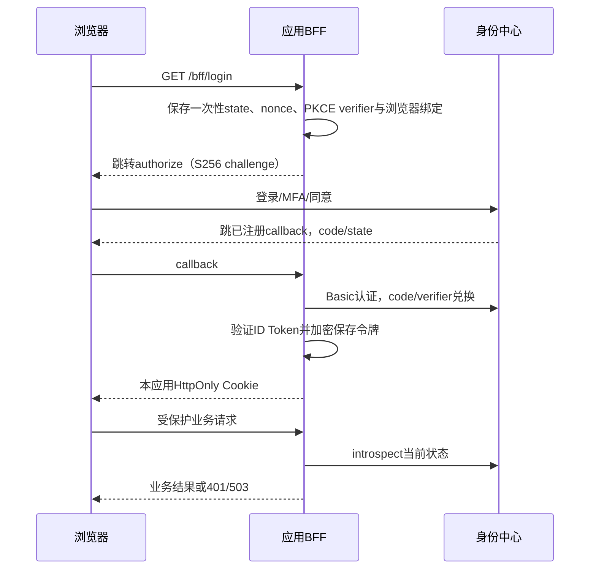

# 开发者接入统一身份认证

CDNGOD 统一身份中心提供 OpenID Connect（OIDC），采用**授权码 + PKCE S256 + 服务端机密客户端**。推荐 BFF（Backend for Frontend）接入：浏览器只有本应用的 HttpOnly 会话 Cookie，客户端秘密及 OAuth 令牌始终留在服务端。

本文的 `https://auth.example.com` 和 `https://app.example.com` 均为需要替换的示例。运维应提供实际 issuer、客户端 ID、秘密和允许的 scope。

## 1. 申请客户端

向管理员提供应用名称、环境和以下配置，由“管理后台 → 应用客户端”创建：

| 项目 | 要求 |
| --- | --- |
| 登录回调 | `https://app.example.com/bff/callback`，完整精确匹配；不接受通配符、fragment或用户名密码 |
| 退出回调 | 如需回跳，预先登记完整地址，例如 `https://app.example.com/` |
| scope | 必须包含 `openid`，按实际需要申请 `profile`、`email` |
| 客户端秘密 | 创建/轮换成功后仅显示一次，存服务端受控文件或秘密管理系统 |

开发、测试和生产使用不同客户端及秘密。秘密文件由运行用户读取，建议0600；不放进前端变量、Git、URL、日志、localStorage或sessionStorage。业务权限由接入应用自己的后端管理，统一登录不等于授予全部业务权限。

## 2. 发现协议端点

服务端读取固定 issuer 的 discovery：

```sh
curl --fail https://auth.example.com/.well-known/openid-configuration
```

核对响应issuer与配置逐字一致，所有端点属于固定issuer；不要从用户输入或未经验证的请求Host决定身份平台地址。

| 路径 | 用途 |
| --- | --- |
| `/oauth/authorize` | 浏览器授权入口 |
| `/oauth/token` | 服务端授权码兑换/刷新 |
| `/oauth/jwks` | 公开签名验证密钥 |
| `/oauth/userinfo` | 按scope获取资料 |
| `/oauth/introspect` | 当前令牌状态检查 |
| `/oauth/revoke` | 撤销本客户端令牌/授权 |
| `/oauth/logout` | 身份中心退出确认入口 |

支持response_type=code、grant_type=authorization_code/refresh_token、client_secret_basic、PKCE S256和ID Token RS256。不要申请未声明的implicit、password grant或动态客户端注册。

## 3. 使用已有BFF接入

CI runtime成品包含 `demo-bff` 可执行文件；A/B以独立配置运行同一程序。参考[BFF源码](../crates/demo-bff/src/http.rs)、[演示前端](../apps/demo-a/src/pages/InitializationPage.tsx)及[BFF详细约定](bff-integration.md)。服务端配置示例：

```dotenv
APP_ENV=production
BIND=0.0.0.0:8082
BFF_PUBLIC_ORIGIN=https://app.example.com
ISSUER=https://auth.example.com
BFF_CLIENT_ID=REPLACE_WITH_ADMIN_ASSIGNED_ID
BFF_CLIENT_SECRET_FILE=/run/secrets/client-secret
DATABASE_URL=postgres://app_identity@postgres/app_identity
BFF_NAMESPACE=my_app
BFF_COOKIE_NAME=__Host-my-app
ENCRYPTION_KEYS_FILE=/run/secrets/encryption-keys.json
ACTIVE_ENCRYPTION_KID=app-aead-1
```

此BFF需要仓库迁移中定义的BFF表和对应权限；数据库与版本化AEAD文件由运维准备，详见[BFF存储](bff-storage.md)。多实例共享同一数据库和兼容密钥，通过行锁串行刷新。不同应用不复用namespace、Cookie或客户端秘密。生产禁止开发的BFF_ISSUER_CONNECT_HOST配置。

```sh
demo-bff --check-config
demo-bff
```

正常启动需要数据库、密钥和discovery可用；check-config不能代替业务验收。反向代理把应用同源 `/bff/*` 和 `/health/*` 转发到BFF，其他路径提供前端。public origin必须与浏览器实际访问地址一致。

前端发起登录和查询会话：

```js
window.location.assign('/bff/login');

const response = await fetch('/bff/session', {
  credentials: 'same-origin',
  cache: 'no-store',
});
if (response.status === 401) {
  // 未登录或已失效，显示登录入口。
} else if (!response.ok) {
  // 无法确认身份，暂停受保护操作并显示可恢复错误。
} else {
  const { user } = await response.json();
  // user.sub是账号标识，业务权限仍由你的后端判断。
}
```

本应用退出：

```js
const proof = await fetch('/bff/csrf', { credentials: 'same-origin', cache: 'no-store' });
if (!proof.ok) throw new Error('无法获得退出确认');
const { csrf_token } = await proof.json();
const result = await fetch('/bff/logout', {
  method: 'POST',
  credentials: 'same-origin',
  headers: { 'X-CSRF-Token': csrf_token },
});
if (!result.ok) throw new Error('退出未完成');
const { revocation_status } = await result.json();
// failed表示本应用已退出，但平台授权撤销暂未完成，应明确提示。
```

`POST /bff/identity-logout`使用同样CSRF，返回redirect_to后顶层导航到身份中心确认退出。两个POST均不发送请求体。应用退出、平台当前设备退出与全部设备退出范围不同，不以清前端状态冒充后端撤销。

## 4. 自行实现BFF的步骤



1. 每次登录生成不可预测state、nonce、code_verifier，保存在服务端限时一次性流程并绑定浏览器。计算BASE64URL(SHA256(verifier))，无padding。
2. 导航至授权端点，携带client_id、response_type=code、完整redirect_uri、scope、state、nonce、code_challenge和code_challenge_method=S256。
3. callback校验单值state、浏览器绑定、有效期和一次性消费；协议error不建立会话。不能仅看到code就登录。
4. 用服务端client_secret_basic POST表单兑换：grant_type=authorization_code、code、同一redirect_uri、code_verifier。使用维护中的OIDC SDK处理Basic编码及验证，不向浏览器提供秘密。
5. 验证ID Token的RS256/JWKS、issuer、audience、nonce、exp/iat等声明，保存sub/sid和认证信息。ID Token不能代替后续即时撤销检查。
6. 发随机__Host- Cookie（Secure、HttpOnly、Path=/、SameSite=Lax、无Domain），令牌加密存服务端，不返回HTML/浏览器。

以响应及声明的有效时间为准，不自行延长会话；不要持久保存用户密码或TOTP种子用于自动登录。

## 5. 刷新、撤销和userinfo

- 受保护请求在服务端确认当前状态；introspect使用本客户端Basic认证与token表单，核对active、sub、client_id、scope、时间和token_type。跨客户端不得使用其他客户端授权。
- 不缓存active=true跳过状态查询。退出、撤销或后台禁用提交后，下一次保护请求拒绝旧身份。
- userinfo使用access token，按已获scope取资料，以稳定sub作为身份键，不以可变邮箱替代。
- refresh POST token端点：grant_type=refresh_token和当前refresh_token；新refresh必须原子替换，多个实例用共享锁避免并发重用。
- 旧refresh重放撤销整个family；执行结果不确定时不要盲重试旧refresh，应失败关闭并重新登录。
- revoke使用本客户端Basic和token表单，幂等200不说明未知token原本有效。应用退出先使本地会话失效，再尝试平台撤销，失败不能恢复登录状态。

## 6. 排错

| 错误/现象 | 核对事项 |
| --- | --- |
| AUTH_ORIGIN_INVALID | 实际origin含端口与配置一致；固定HTTPS域名，不伪造或放开Origin |
| AUTH_CSRF_INVALID | 同源Cookie与CSRF绑定；认证后更新CSRF，不跨应用复用 |
| invalid_client | ID/秘密匹配、是否停用/已轮换，使用Basic认证 |
| invalid_grant | code消费/过期、redirect/PKCE错误、refresh撤销或重放；重新登录 |
| invalid_scope | 包含openid且不超后台允许集合 |
| callback拒绝 | state/nonce/flow Cookie与发起浏览器匹配，核对代理及Cookie属性 |
| 429 | 遵守Retry-After，不自动连续重发或清限流 |
| 503/超时 | 身份无法确认，暂停保护操作，不用历史结果继续授权 |
| TLS/discovery失败 | DNS、有效CA、issuer及端点归属；生产不关闭TLS验证 |

JSON错误通常为error.code/message/request_id；OAuth端点使用标准OAuth错误。排错提供request_id和脱敏信息，不输出密码/OTP/Cookie/token/code/client secret。

## 7. 接入验收

验证首次登录/同意/取消、错误state/nonce/PKCE、重复code、刷新并发、应用退出、平台全部退出、后台禁用账号/客户端、秘密轮换、依赖超时失败关闭。确认A/B会话与秘密隔离，浏览器存储和网络无OAuth秘密。

更多资料：[BFF详细约定](bff-integration.md)、[OpenAPI](api/openapi.yaml)、[生产安装](runbooks/production-ci-deployment.md)、[当前验收边界](evidence/T23/remaining-verification.md)。实际协议能力以当前discovery和服务源码为准。
