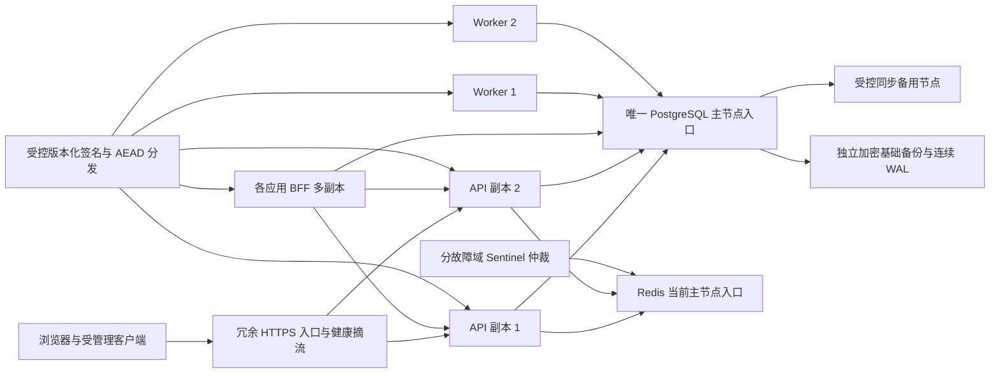

# 后续高可用升级设计与验收计划

本文补充[plan.md](../../plan.md)第1.1.9项的升级文档，对应T24.01～T24.08。它是后续阶段可审查的设计与操作计划，**没有实现或部署多副本、数据库自动切换、Redis Sentinel或99.9% SLO**，没有把T24步骤标为完成。T24实际实施前须先满足T23前置、提供独立主机/故障域/网络/监控资源，并另执行真实验收；第一版单机维护中断仍按[单机runbook](single-host-deployment.md)处理。

沿用已选Rust/Axum、PostgreSQL、Redis、Caddy和标准SMTP。此文不新增依赖、HA管理软件或镜像版本，不给未核查软件写安装命令；实际实施选择数据服务管理方式后先记录官方来源、许可、精确版本与不可变digest，再提交可审查配置。现有`infra/compose.prod.yaml`是单机配置，不能通过复制API服务就视为完整HA。

## 目标拓扑与权威检查



至少两个API运行在独立故障域，HTTPS入口自身也要有冗余，否则入口仍是单点。入口只使用通过readiness的副本；启动/迁移/恢复未完成的副本不接流量。相同固定issuer/RP、精确代理CIDR、Cookie属性及client回调分发给全部副本，不依赖sticky session维持身份事实。每次用户或token权威检查仍到PostgreSQL，不引入active正缓存来换可用性；浏览器Cookie或ID Token不能替代最新grant/session/user/client状态。

当前应用通过显式`DATABASE_URL`连接SQLx池，**没有内置主节点自动发现、角色栅栏或跨数据节点切换编排**。目标主节点入口必须只指向一个已确认可写的新主节点。每次切换前后核验`pg_is_in_recovery()`、timeline/LSN、复制状态和写入探针；发现备用节点、复制状态不确定或双主可能时，停发新身份凭证和摘除readiness，不能继续读取旧副本状态当已登录。角色/写入探针如何接入需要T24实现并真实测试，不能仅靠此文宣称现有readiness已保证主节点身份。

## PostgreSQL 切换与撤销不可倒退

已提交的禁用、密码版本变更、session/grant撤销、code/action/challenge消费和refresh重放家族撤销都是安全事实。HA切换不能把这些提交丢掉后恢复凭证有效；T22事故备份RPO容许丢失窗口不自动等同于“可丢弃已提交安全撤销”。

后续设计要选择能证明提交持久化边界的同步复制/仲裁策略：指定同步备用与适合的同步提交要求，写成功仅在选定持久化条件满足后返回；记录其延迟和失去同步节点时的行为。主节点故障后先隔离旧主写权限和客户端入口，再确认候选备用已包含最后确认提交的安全LSN，才允许promotion/接流量。无法证明时保持认证/刷新503并进入受控恢复，不能为了迅速恢复跳过确认。严禁old primary与new primary同时接受写入。

切换操作计划：

1. 记录最后健康主节点、timeline、复制LSN、同步状态、当前发布/key版本及已确认安全事务水位；原始日志受控脱敏。
2. 摘流/限制写入，证明旧主被fence，阻断其旧连接和代理路由；不仅停止某个API。
3. 候选确认复制追平和安全提交水位、磁盘/WAL可用后promotion；不从滞后备库做introspection“应急只读”。
4. 主节点入口切到唯一新writer，旧连接池关闭/重建并验证失败事务没有误提交；进行真实写入和`pg_is_in_recovery=false`核对。
5. 先用测试账号执行已撤凭证inactive、已消费code/refresh重放拒、禁用不可登录等权威检查，再允许API/Worker/BFF接流量。
6. 旧主回归前重新初始化为备用并校验timeline，不能恢复原主身份直接加入写入口；备份/复制重新健康后关闭事件。

这是未来操作顺序，当前没有实现任何promotion/fencing命令。实际管理平台确定后才能填入准确操作和回滚步骤；不得拿普通Docker stop/start冒数据层故障切换验收。

## Redis Sentinel、预算与失败关闭

目标为一主多副本、至少三个Sentinel进程分布不同故障域，明确quorum、认证/TLS、监控及唯一主节点服务名。API仍只信任Redis的原子预算/辅助状态；单次认证消费与撤销权威继续在PG。当前`REDIS_URL`和缓存连接只连接指定Redis地址，**没有现成Sentinel发现配置**；后续须通过已核查客户端能力或受控主节点入口实现发现/连接重建，并保持原2秒边界及失败503，不自动信任本机旧预算或绕过限流。

Redis复制可能导致切换丢失最近预算计数，Sentinel本身不保证零预算回退。T24须记录允许的辅助状态恢复策略并检验安全预算：无法确认预算连续性时保持依赖失败关闭，或按审查过的最保守预算/等待原窗口恢复；不能清空预算后把限流重新可用当切换成功。使用同一真实来源/账号重复检测切换前后预算，不能每场随机新键规避重置问题。共享连接失效后关闭并解析当前主节点，验证不是继续连接old master；旧主fence完成前不双写。生产TLS/秘密权限和Redis配置不得为演练降级。

## API、BFF、Worker 与密钥共享

- API副本共用PG、Redis和固定配置，内存只保存可重建的连接/聚合指标。预认证、认证挑战、OAuth事务和身份session不靠某个进程内存；A副本创建的流程交给B仍应绑定同一浏览器、用途和过期规则。
- 每个业务应用的BFF副本共用对应namespace的PG加密session/flow，仍每次introspection，PG会话行锁串行化refresh；A/B应用namespace、Cookie、client secret不同。一个副本刷新后另一个读取新凭证，不用进程锁或sticky session代替共享锁。状态不可达返回503并按既有策略清本地session，不能回退到JWT的历史登录结果。
- 多Worker继续短事务`FOR UPDATE SKIP LOCKED`领取，SMTP在领取提交后执行。每次领取生成新的lease nonce，完成须匹配owner和未过期lease；同worker重启也不能用旧租约完成新领取。SMTP接受后进程崩溃可能重复送达，不能承诺exactly-once；邮件action仍单次消费，失败重试/密文清理/审计必须一致。清理任务也要定义独占或可并发幂等策略，不能多副本相互删除活动数据。
- 只读key文件经受控流程分发到全部API/Worker/BFF，版本与摘要可核对，但不输出key值。签名新公钥先在所有服务/JWKS可见，再切各副本私钥kid；滚动期间新旧公钥都保留，至少覆盖最后旧签凭证的12小时+2分钟hint窗口。AEAD map包含新旧kid，确认旧版可读新记录后才滚动，批重加密不能使未更新副本失去解密能力。旧key保留至当前记录与保留备份均不再依赖，按[密钥runbook](key-maintenance.md)回滚。

## 滚动升级、schema窗口与回滚

迁移仍是明确独立维护任务，只运行一次，不能每个副本启动自动迁移。先做已验证独立备份及WAL健康、核对SQLx history/current key集合和前版兼容范围，再采用expand/contract：先添加能让旧/新进程同时工作的schema，更新副本后观察并验收，最后单独窗口移除旧字段/约束。破坏性contract未经旧版兼容验证禁止混跑，也禁止自动down migration。

发布一副本时先摘流、等待其在途请求退出、启新immutable image、验证schema/key/readiness、执行业务冒烟才重新入池；保持另一健康副本承接。版本间认证/撤销语义、AAD、nonce/kid、client配置必须兼容，不为滚动窗口增加refresh重放宽限。至少两副本不能证明负载入口、PG/Redis或独立存储可用性，需要整体故障验证。

回滚先判断schema/key兼容证据和保留镜像，兼容才按副本逐个切回并再验证权威状态；不兼容则按已审查恢复计划说明中断，不在不确定数据上自动旧版启动。[现有release编排](../../infra/ops/release.mjs)是单机工具，可以复用新备份/事实核查思路，不能直接作为冗余部署controller；T24滚动摘流、promotion和仲裁需独立实现。

## 故障验收矩阵

所有故障先在拥有独立PG/Redis/应用/网络的测试环境完成，并指定唯一控制者、恢复步骤、退出码和清理范围。不得故障注入共享开发依赖或生产数据后无恢复准备。表中的结果是**待执行预期**，当前没有T24实际成功记录。

| 场景/指定交错 | 实际验证要求 | 失败处理 |
|---|---|---|
| API1停止，API2接流量 | API1先创建session/challenge/OAuth flow，API2读取并完成；入口摘流后密码/MFA/Passkey/SSO正常，记录中断 | 剩余副本不ready则503，不信任Cookie或缓存 |
| API1撤销→API2立即检查/refresh | 用同步屏障证明撤销提交先于另一副本读取；inactive/invalid_grant且无新有效凭证，反向提交新token也在撤销后无效 | 任何回退为active均阻止放行 |
| 主PG故障或旧主网络隔离 | 实际fence/promotion、新writer角色/安全LSN确认；切换后旧禁用/已撤/已消费状态不倒退，锁等待事务不半提交 | 无法证明安全水位保持503；旧主禁止双写 |
| Redis主节点停止/Sentinel网络分区 | 真实发现当前主、共享连接重建、同来源预算不回退；不同Sentinel见解不允许旧主双写 | 预算不确定/无quorum保持失败关闭 |
| BFF两个副本同时refresh | 同真实session十并发、只一次正确轮换，另一副本读新pair；故障无无限重试已消费refresh | 状态或刷新失败按原规则清session/503 |
| Worker领取后停止/SMTP超时 | 旧lease不能完成新claim；租约到期后另Worker重试，action仍有效且单次；审计/清密文时序正确 | 保pending/due或明确永久失败，不删除未投递动作 |
| 混跑新旧schema/key | 旧版可读新记录，两kid公钥可验；升级/回滚中MFA/refresh/审计不丢，未知kid拒绝 | 停止扩大发布并保留key/旧镜像，不自动降库 |
| HTTPS入口或一故障域停机 | 至少另一入口/副本/数据仲裁能承接；固定issuer/Cookie/CSP/回调不改变 | 无健康路径时明确503，不降低TLS或认证 |
| 独立备份恢复新数据集群 | 已知时间点完整password/TOTP/实体Passkey/OAuth/撤销、签名/AEAD/配置可恢复；记录RPO/RTO | 坏备份/缺key/断WAL失败，禁止用旧成功代替 |

## 测试命令与证据计划

当前可执行的单机回归继续保留：

```sh
npm ci
npm run check
npm run test:unit
npm run test:integration
npm run test:e2e
npm run test:security
npm run test:accessibility
npm run build
npm run test:load -- --scenario=mixed
```

这些命令当前读取已有测试/单机数据目标，不是T24多节点测试或HA测量。T24实施时须新增明确多副本/主备/Sentinel的独立fixture及任务runner，接入必要manifest，缺环境必须非零；**当前不存在可声称通过的`--task=T24`/HA故障命令**，不能用虚构命令或只改报告完成验收。拓扑工具确定后逐项记录实际启动、fence/promotion/恢复、日志与计时命令，再按矩阵执行。load仍按原120秒预热/900秒测量和安全参数；多副本/新数据层须重新测量参考硬件，不能套用单机355RPS或短阶梯结果。

每次证据包含明确Git提交/dirty状态、image digest、配置非秘密摘要、节点/故障域角色、当前key版本、SQLx migration checksum、指定事务屏障、故障开始/恢复实际时间、HTTP状态/延迟/错误分类、已确认安全水位与切换后数据检查。角色/LSN证据受控脱敏，不能发布真实token/Cookie/密码/OTP/私钥/恢复码。失败、异常和复测都保留；没有实际窗口数据的字段写未测，不能补估计时间。

## SLO 与恢复指标的定义草案

T24目标建立99.9%可用性，但目前没有生产统计窗口、切换实验或SLO达成证据，**不承诺已经99.9%或零中断**。后续先定义30天滚动窗口与实际用户/客户端认证检查的总数，成功包含合法2xx/3xx和明确预期4xx（例如错误密码/expired/revoked），服务端5xx、不可达、超时及非预期拒绝归失败；受控攻击流量单独分类，不能靠大量预期401稀释服务故障。外部/入口探针用于补测未进入API的不可达，不能只算API收到的请求。

按预先公布的操作族分别看可用性与延迟（密码含CSRF/MFA步骤、introspection、refresh、授权/SSO），不把15秒聚合采样当全部单请求尾延迟。选择request-based还是time-based SLI后固定分母与排除项；time-based 99.9%的30天错误预算约43.2分钟是计算示例，不是当前实测。计划维护是否计预算应事先约定并同时公开包含维护的用户可用性，不能事后排除事故。

RPO按事故假定时刻到已恢复、可业务确认的最后提交时间间隔；RTO从恢复/故障处理开始到完整业务验证可用，不只统计PG启动。安全提交不倒退另独立检查，不能以“RPO≤15分钟”允许复活已撤凭证。先沿T22目标RPO≤15分钟/RTO≤60分钟实测，再根据HA方案提出有证据的新目标；复制、备份、key custody和独立故障域都需验收。错误预算、多窗口告警、负责人和触发回滚条件在真实监控系统部署后验证通知到达。

只有T24全部必要实现与矩阵/恢复/SLO独立验收完成后，才更新任务状态和对外可用性说明。本文完成的是升级文档产物，不把第一版的本地测试结果或设计图当HA系统。
