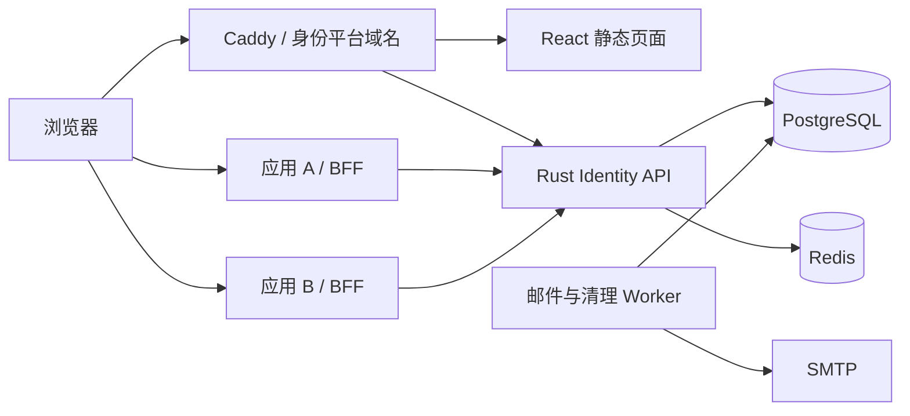

# Rust 统一身份验证系统：可执行实施计划

文档版本：1.0  
编写日期：2026-10-07  
文档语言：简体中文  
配套验收文档：[acceptance.md](acceptance.md)

> 初始交付为规划和验收文档；用户已于 2026-10-07 授权严格按文档实施代码。原始环境与文档交付记录保留为历史事实，当前状态以 acceptance.md 的实际验收记录为准。未经实际运行的测试不得标记“通过”。

## 1. 目标与已经确定的决策

### 1.1 产品目标

建设面向真实用户的身份提供方（Identity Provider / OpenID Provider），使用 Rust 提供后端能力，React 提供完整用户界面。多个业务应用通过 OAuth 2.0 / OpenID Connect 接入统一登录，实现跨应用 SSO。

第一版必须完整覆盖：

1. 邮箱注册、邮箱验证、密码登录、密码找回和修改。
2. Passkey 注册与登录、TOTP、单次恢复码。
3. 标准授权码流程、PKCE S256、ID Token、userinfo、令牌状态检查、刷新与撤销。
4. 账号与安全中心、设备会话列表、已授权应用管理。
5. 管理后台：用户状态、会话撤销、应用客户端、管理员和审计。
6. 品牌首页、全部认证页面及后台界面。
7. 两个独立服务端 Web/BFF 演示应用，验证跨应用 SSO。
8. 单机生产配置、邮件投递、指标告警、备份与恢复。
9. 后续高可用升级文档及独立验收任务。

### 1.2 用户已选择的方案

| 决策 | 已确定方案 |
|---|---|
| 产品范围 | 多应用统一登录中心 |
| 第一阶段规模 | 生产使用，中小规模，约十万账号和每秒数百次状态检查 |
| 后端 | Rust、Axum、Tokio |
| 前端 | React、TypeScript |
| 数据 | PostgreSQL、Redis |
| 登录 | 邮箱密码、Passkey、TOTP、恢复码；第一版无社交登录 |
| 业务客户端 | 仅服务端 Web / BFF，浏览器不持有 OAuth 令牌 |
| 权限范围 | 身份及平台管理权限；业务权限由接入应用负责 |
| 撤销 | 提交后立即影响下一次认证检查 |
| 邮件 | 标准 SMTP，本地使用 Mailpit |
| 界面 | 简体中文，预留国际化字典 |
| 设计 | 克制的编辑式科技风，研究 Awwwards 获奖网站 |
| 部署 | 先单机容器部署，再升级高可用 |
| 验收 | 逐步证据验收，记录命令、结果、环境和产物 |

### 1.3 第一版不实现的能力

多租户、企业组织、SAML、LDAP、SCIM、企业身份源、社交登录、移动原生客户端、浏览器公共 OAuth 客户端、动态客户端注册、设备授权流、机器到机器授权、业务角色权限、商业计费、管理员代登录、人工绕过 MFA、自动销号和历史数据导出。

这些能力不得通过“顺便添加”扩大第一版范围。业务应用自行实现授权，身份平台不得以“已登录”替代业务权限判断。

## 2. 当前环境与真实完成状态

工作目录为 `D:\Code\Rust\AUTH_RUST`。开始规划时目录为空，没有既有项目、接口和兼容约束。文档编写时可用 Rust 1.98.0、Node 24.11.1、npm 11.6.2、Git；未发现 Docker，因此没有执行 PostgreSQL、Redis、Mailpit 或浏览器集成验收。

RFC 9700 正文已成功读取。Awwwards 页面本次访问未成功，没有核实具体获奖案例。设计研究必须在 T15 中补齐官方来源，不得将未经核实的网站标记为获奖参考。

初始规划轮不创建代码、依赖清单、部署服务或运行测试，当时两个 Markdown 文件是唯一交付物。

2026-10-07 开始实施，实际目录为 `/root/code/rust/auth_rust`，Linux/WSL2。初始执行环境 Node 22.22.1、npm 9.2.0，未安装 Rust/Docker；现已安装文档指定 Rust 1.98.0、Docker/Compose 并进行 T01 实测。原 Node 24 环境记录不表示当前环境；本次选用同技术路线且经过兼容核查的 Node 22.22.1/npm 9.2.0，精确锁文件与依据见 `docs/adr/0001-toolchain-dependencies.md`。T01 已通过当前 Linux/Compose 工程基线验收；T03 数据基础及 T15/T16 设计和前端基础已通过；用户确认视觉方案，T04安全基础及T05注册/验证/邮件已通过；用户已恢复推进，按模块验收后提交推送；T06～T08及T10～T11已通过，T09实体设备待验收，T12刷新/撤销已通过，T13双BFF已通过，当前T14管理模块继续实施，其余按依赖继续。

## 3. 如何把本文交给实现模型

### 3.1 执行纪律

1. 先阅读本文第 1～9 节以及当前任务对应的验收记录。
2. 从 T01 开始，按前置依赖推进。T00 是本轮文档交付检查。
3. 每次只处理一个任务或一个明确编号的子步骤，避免同时修改认证协议、数据模型和 UI。
4. 开始时列出该任务将修改的文件、接口和需增加的行为测试。
5. 按步骤实现，严禁以模拟成功、跳过校验、放宽类型或删除测试完成任务。
6. 在已有模块边界内实现；不得自行更换技术栈、令牌策略、协议支持范围或 Cookie 策略。
7. 引入依赖前核查维护状态、安全公告和许可证。固定 toolchain、锁文件和镜像版本。
8. 测试密码、验证码、令牌、Cookie、私钥时不得将实际秘密写入 Git 或证据。
9. 每个任务填写 `acceptance.md` 中实际结果和证据；失败要记录，不标记通过。
10. 发现文档矛盾时记录具体段落及影响，修订文档并同步验收，再继续相关代码。
11. 无外部条件时继续不依赖它的工作；受阻任务保持“阻塞”，不得使用 mock 冒充真实验收。
12. 全部基础任务通过后才能开始生产发布。T24 为后续阶段，不阻塞第一版。

### 3.2 建议目录

以下目录在对应任务创建，不表示当前已经存在：

```text
/
├─ plan.md
├─ acceptance.md
├─ Cargo.toml / Cargo.lock / rust-toolchain.toml
├─ package.json / package-lock.json
├─ crates/
│  ├─ identity-core/       # 状态机、值对象、密码与安全规则
│  ├─ identity-store/      # SQLx 仓储、事务、迁移封装
│  ├─ identity-server/     # Axum 接口、Cookie、协议路由
│  ├─ identity-worker/     # outbox、到期清理
│  ├─ identity-admin-cli/  # 管理员初始化、密钥维护
│  └─ demo-bff/            # 同一二进制运行两个独立配置实例
├─ apps/
│  ├─ identity-web/
│  ├─ demo-a/
│  └─ demo-b/
├─ migrations/
├─ scripts/               # 跨平台 Node 编排
├─ tests/                 # API 集成、Playwright、k6
├─ infra/                 # 开发与生产 Compose、Caddy、容器
└─ docs/
   ├─ architecture.md
   ├─ api/openapi.yaml
   ├─ adr/
   ├─ design/reference-study.md
   ├─ runbooks/
   └─ evidence/Txx/
```

演示 BFF 复用同一包，但 A/B 使用不同 client ID、秘密、会话 Cookie、数据库会话空间和回调，运行两个实例。公共代码不能使两个客户端共享授权上下文。

## 4. 技术架构与工程约束

### 4.1 组件选型

| 组件 | 选型 | 使用规则 |
|---|---|---|
| HTTP | Axum、Tokio、Tower | handler 仅处理输入输出，事务与安全规则在服务层 |
| 数据库 | PostgreSQL 17、SQLx | 显式迁移，参数化 SQL，不在运行时拼接用户输入 SQL |
| 缓存 | Redis 7.4 | 限流及预认证状态；不得缓存有效授权绕过撤销 |
| React | React 19、TypeScript strict、Vite | 按路由拆包，认证秘密不进浏览器持久化存储 |
| 数据请求 | TanStack Query | 管理加载、失败、刷新和缓存失效 |
| 表单 | React Hook Form、Zod | 客户端提示不能替代服务端校验 |
| UI 基础 | Radix UI、CSS 变量 | 使用语义元素，定制视觉但保留键盘及焦点行为 |
| 密码 | Argon2id | 显式资源参数及并发限制 |
| Passkey | webauthn-rs | 使用库验证 RP、origin、签名、challenge 和 UV |
| 签名 | 维护中的 JOSE/JWT 库、RS256 | 固定算法，不接受 token header 自选算法 |
| 种子加密 | AES-256-GCM | 每次独立随机 nonce，绑定用户和用途为 AAD |
| 邮件 | lettre SMTP transport、Mailpit | outbox 异步，生产 TLS 验证不得关闭 |
| 日志 | tracing、结构化 JSON | 默认不记录 query、请求体和认证头 |
| 指标 | Prometheus，OpenTelemetry 接口 | 不把 email/user ID/token 放入指标标签 |
| 浏览器测试 | Playwright、axe-core | 真实页面流程及自动可访问性检查 |
| 压测 | k6 | 独立认证流、状态检查流和综合负载 |
| 边缘入口 | Caddy | TLS、静态资源、反向代理 |
| 开发部署 | Docker Compose v2 | Postgres、Redis、Mailpit、API、Worker、前端 |

T01 核实以上主版本的稳定兼容组合，固定精确依赖和容器 tag/digest，提交锁文件。发现安全问题时选择同一技术路线中的修复版本并记录 ADR，不能继续使用已知不安全版本。

### 4.2 请求与信任边界



- 身份平台网页与 API 同源。
- OAuth 访问/刷新令牌仅在 BFF 服务端存储，浏览器只持有随机会话 Cookie。
- 账号、身份会话、OAuth 授权、一次性动作和撤销状态以 PostgreSQL 为权威。
- 为确保并发单次消费，MFA 和 WebAuthn 挑战使用数据库权威记录；Redis 只承担限流与预认证辅助状态。
- Worker 从 PostgreSQL outbox 领取任务，数据库事务内不调用 SMTP。
- 已验证身份不意味着拥有某业务操作权限；BFF 认证后还要执行自己的授权。
- 邮箱不是主键。用户 UUID 与 OIDC `sub` 稳定，不能由客户端传入覆盖。

### 4.3 配置契约

配置在启动时解析并校验，秘密不可回显：

| 配置 | 作用与约束 |
|---|---|
| APP_ENV | development/test/production，枚举之外拒绝启动 |
| BIND | 本地默认 127.0.0.1:8080；容器内部显式 0.0.0.0 |
| ISSUER | 固定 origin；无路径、query、fragment、userinfo；生产必须 HTTPS |
| RP_ID | 第一版必须等于 issuer host |
| DATABASE_URL / REDIS_URL | 必填，不写入日志 |
| SIGNING_KEY_FILE / SIGNING_KID | 私钥文件和当前 kid |
| JWKS_PREVIOUS_FILE | 可选旧公钥集合，不包含私钥 |
| ENCRYPTION_KEYS_FILE / ACTIVE_ENCRYPTION_KID | 版本化 AEAD 密钥映射和当前版本 |
| SMTP_HOST/PORT/USERNAME/PASSWORD_FILE/FROM | 生产要求有效 TLS；开发 Mailpit 单独分支 |
| SMTP_TLS | required 验证 TLS 证书；disabled 只允许 development/test 本机或 Mailpit；生产拒绝 disabled |
| TRUSTED_PROXY_CIDRS | 显式白名单；默认不信任转发头 |
| DATABASE_POOL_MAX | 初始 32，结合压测和数据库上限调整 |
| ARGON2_PARALLELISM_LIMIT | 初始 4，最大等待 250 ms |
| BACKUP_DESTINATION | 生产独立备份存储，由备份任务读取 |

生产缺少秘密、非 HTTPS issuer、错误 RP ID、弱 Cookie 设置、开发种子开关或明文 SMTP 配置时必须拒绝启动。禁止从请求 Host 自动决定 issuer、邮件地址或回调。

### 4.4 根脚本契约

T01 创建跨平台 Node 脚本；Windows/ Linux 同名命令行为一致。后续验收引用它们：

| 命令 | 必须执行的内容 |
|---|---|
| npm ci | 按 package-lock 安装 |
| npm run check | cargo fmt --check、clippy -D warnings、TS、ESLint |
| npm run test:unit | Rust 单元测试与前端 Vitest |
| npm run test:full | 顺序运行完整安装、检查、单元、集成、E2E、安全、可访问性和构建；失败不中断其余检查，生成 TEST_SUMMARY.md，整体非零 |
| npm run test:integration -- --task=Txx | 真实 Postgres/Redis/API 测试，按任务筛选 |
| npm run test:e2e -- --task=Txx | Playwright 任务标签测试 |
| npm run test:security [-- --task=Txx] | 按任务运行已实现安全与协议负向测试；全量未完整时拒绝伪成功 |
| npm run test:load -- --scenario=name | k6 指定场景及阈值 |
| npm run test:accessibility | Playwright + axe |
| npm run build | Rust release 和全部前端 production 构建 |
| npm run db:migrate | 对显式目标执行迁移，打印环境名称而非秘密 |
| npm run dev:up / dev:down | 启停开发 Compose，不隐式删除卷 |
| npm run seed:acceptance | 测试数据；拒绝 production 和非白名单测试库 |
| npm run verify:docs | 任务 ID、依赖、相对文档链接和状态一致性检查 |

所有失败子进程返回非零退出码，不能忽略错误。不得自动把不存在的测试返回成功。

## 5. 安全与认证行为契约

### 5.1 密码和邮箱

- 邮箱：ASCII，trim 后全地址转小写，最多 254 字符；本地部分最多 64；拒绝控制字符和非法域名。保留点号和 +tag，不合并服务商别名。
- 密码：15～128 个 Unicode 字符且 UTF-8 不超过 512 字节，允许空格与粘贴；不强制字符组合，不按周期强制修改。
- 弱密码使用版本化本地清单检查；清单注明来源、许可和校验值。不能将实际密码发送外部 API。
- Argon2id 初始 m=65536 KiB、t=3、p=1；校验读取编码中的参数，重登录可重新编码升级。
- 每进程最多四个哈希任务，使用阻塞任务池，等待超时返回可重试错误。
- 未知邮箱执行同等参数的预计算 dummy hash 校验；不为每次未知账号重新生成 hash。
- 未验证邮箱不能签发普通会话、OAuth 授权或新增 Passkey。
- 注册/重发/找回统一返回 202 文案，不透露邮箱是否存在。
- 新旧密码、秘密、完整邮件链接不能出现在日志、审计和指标。

### 5.2 有效期与令牌

| 对象 | 默认规则 |
|---|---|
| 身份会话 | 12 小时绝对到期，登录后随机轮换 |
| 预认证上下文 | 10 分钟，安全随机 Cookie，仅用于流程/CSRF |
| OAuth 授权事务 | 5 分钟，一次完成 |
| 授权码 | 60 秒，单次成功消费 |
| 不透明访问令牌 | 5 分钟 |
| 不透明刷新令牌 | 每次使用轮换，绝对不超过会话的 12 小时到期 |
| ID Token | 5 分钟，RS256 |
| 邮箱验证动作 | 30 分钟，重发作废旧动作 |
| 密码重置动作 | 15 分钟，单次消费 |
| MFA/Passkey/重新认证挑战 | 5 分钟，单次消费 |
| 高风险操作认证窗口 | 最近 5 分钟 |

令牌和恢复码使用 CSPRNG。会话/授权码/访问令牌/刷新令牌至少 256 位熵，恢复码每个至少 128 位。数据库只存摘要；TOTP 种子和待注册 Passkey 状态按需要加密。

ID Token 是身份声明，不是业务请求凭证。不得在业务应用仅本地验签 ID Token 后继续接受被撤销用户。

### 5.3 立即撤销与竞争条件

1. introspection 每次读取当前用户、会话、授权、客户端和 token 状态，不使用有效结果正缓存。
2. 撤销事务提交后开始的检查必须无效；提交前已通过检查的请求允许结束，不声称取消正在执行的业务操作。
3. 用户禁用、密码变化、退出全部设备撤销全部会话和派生授权。
4. 单会话退出只撤销当前会话及其派生授权；单应用授权撤销仅影响对应授权。
5. 刷新令牌使用后记录 consumed；再次出现撤销整个家族，不能通过短暂重放宽限隐藏漏洞。
6. BFF 以服务端会话为键串行刷新，多实例部署必须使用共享锁/数据库锁，不能只用进程内 mutex。
7. 数据库事务锁顺序统一为用户→会话→授权→token/action，避免与禁用、退出竞争产生有效新 token。
8. 状态查询失败时 BFF 拒绝受保护请求并返回 503；用户明确无效时清理应用会话并重新登录。
9. Redis 故障时限流相关认证入口失败关闭；Postgres 故障时所有依赖身份检查的操作失败关闭。
10. 不在测试中用长 sleep 等待过期；使用可注入时钟或显式数据库时间字段构造边界。

### 5.4 MFA、Passkey 与恢复

- 密码登录且 TOTP 已开启：只签发有限 MFA 挑战，验证第二因素前无普通会话。
- Passkey 登录要求服务器确认 User Verification=true，可满足平台强认证，不再额外要求 TOTP。
- 普通账号尚未配置 MFA：密码近期重新认证可以执行首次 TOTP/Passkey 绑定及密码修改。
- 已配置 MFA 的账号：新增/删除认证器、重建恢复码、修改密码要求 TOTP、Passkey 或一次性恢复码完成近期强认证，只有密码不够。
- 管理员后台始终要求强认证；管理员未完成因素绑定时只能访问受限绑定流程。
- TOTP 使用 30 秒时间步、六位数字、当前及前后一个时间步；数据库原子检查 last_step，拒绝已用/更早步。
- 五次挑战失败即作废，重新开始登录；限流不得永久锁定账号。
- 恢复码十个，只显示一次；重新生成使旧码全部失效。
- 邮箱重置不取消 TOTP、不添加 Passkey、不直接创建登录会话。
- 不能删除最后一个有效登录方式。Passkey-only 的后续策略不在第一版扩展；当前账号注册始终具有密码。
- 不提供客服/管理员直接清空 MFA 的接口；凭证全部丢失的恢复政策留在后续明确。
- 同步 Passkey 计数器按库及规范处理，不能一概要求递增。RP/origin/challenge/签名/UV 校验不能省略。
- 安全变化提交后发送通知；邮件失败不回滚已完成安全操作。

### 5.5 浏览器、Cookie、CSRF 和限流

- 生产主 Cookie 使用 __Host-identity，Secure、HttpOnly、Path=/、SameSite=Lax、无 Domain；预认证 Cookie 同样安全。
- 开发 Cookie 使用不同名称，仅 localhost 可使用非 Secure。
- 不在 localStorage/sessionStorage/IndexedDB 持久化密码、验证码、认证 token 或恢复码。
- 状态变更验证精确 Origin 和与当前会话绑定的 CSRF Token。登录前有预认证 CSRF，上线后轮换。
- OAuth authorize 的顶级 GET 只创建短期流程，不执行同意、退出或账号修改。
- 登录完成后在同一事务将当前授权事务绑定新会话，再轮换预认证状态；不能因为 Cookie 轮换丢失或错误复用原事务。
- 邮件链接把一次性 token 放 URL fragment；页面读取后立即 history.replaceState 清除，再由用户点击按钮 POST 消费。避免邮件扫描器 GET 提前消费和 Referer 泄露。
- API 默认同源，token/introspection 不开放浏览器 CORS。
- CSP：self 脚本、不使用 unsafe-eval/任意内联、frame-ancestors none、object-src none、base-uri none；按实际资源细化。
- 认证页面 Referrer-Policy=no-referrer，响应 no-store；静态 hash 资源长缓存。
- 登录：账号摘要 5 次/分钟，可信 IP 30 次/分钟；邮件：目标 3 次/小时、IP 20 次/小时；WebAuthn/MFA 同步加入 IP 与挑战预算。
- IP 仅从已配置可信代理提取，否则使用连接来源，禁止客户端伪造转发头。
- 超额返回 429 和 Retry-After；邮件账号维度仍返回统一 202，不泄露存在状态。
- 认证/协议请求体最大 64 KiB；普通 JSON 默认 32 KiB。WebAuthn 若真实证明超出限制，以测试依据单独调整。
- 不把 token、client secret、OAuth code 放入 access log；OAuth query 也必须脱敏。

## 6. OAuth / OIDC 和 API 契约

### 6.1 协议范围与端点

只支持机密客户端、client_secret_basic、Authorization Code + PKCE S256、refresh_token。所有客户端强制 PKCE，包括有 client secret 的 BFF。

| 端点 | 方法 | 行为 |
|---|---|---|
| /.well-known/openid-configuration | GET | 公开实际支持能力 |
| /oauth/jwks | GET | 当前及兼容窗口内公钥，按 kid 选择 |
| /oauth/authorize | GET / POST form | 两种方法使用同一参数校验，仅进入短期登录/同意事务，不执行同意 |
| /oauth/token | POST form | 授权码交换或刷新 |
| /oauth/userinfo | GET | Bearer token 验证及 scope 过滤 |
| /oauth/introspect | POST form | Basic 客户端认证，查询本客户端 token |
| /oauth/revoke | POST form | Basic 客户端认证，幂等撤销 |
| /oauth/logout | GET / POST form | 校验 RP 退出请求并展示确认，两种入口都不撤销 |
| /oauth/logout/confirm | POST | Origin/CSRF 验证后完成退出 |

- discovery 包含 issuer、endpoints、jwks_uri、code、authorization_code/refresh_token、S256、RS256、client_secret_basic、openid/profile/email。
- 只接受预注册完整回调字符串，生产 HTTPS，开发仅 loopback HTTP。禁止通配符、前缀匹配和用户提供 return_to。
- authorize 要求 client_id、response_type=code、redirect_uri、scope 含 openid、state、nonce、code_challenge、method=S256。
- state/nonce 长度 16～512 ASCII 字符；PKCE challenge 为合法 43 字符 base64url；verifier 按 RFC 7636 的 43～128 个允许字符验证。
- 第一版支持 prompt=login/consent/none；none 不与其他值组合。未登录或需同意时按协议返回 login_required/consent_required。支持 max_age 非负整数并按 auth_time 判断。
- 同意必须展示客户端与 scope，既有同意仅覆盖同客户端已批准 scope。用户拒绝返回 access_denied。
- 未验证 redirect_uri 的错误只能停留身份域；已验证回调的协议错误带回 state。
- 拒绝重复关键参数、未知 grant、非法 scope，不静默选择多个同名参数之一。
- token 端点接收 form 编码，Basic 秘密不放 URL，授权码必须绑定原 client/redirect/PKCE。
- ID Token：iss/sub/aud/exp/iat/nonce/auth_time，以及实际 amr；sid 用于绑定身份会话。刷新签发的新 ID Token 不回放授权 nonce。
- amr：密码 pwd，TOTP pwd+otp，Passkey 使用与库结果匹配的 hwk/user 约定并在接入文档明确，不能虚假声明硬件保护。
- userinfo：sub；profile scope 才返回 display_name（若有）；email scope 才返回 email/email_verified。
- introspection 对未知、过期、撤销、错误归属 token 返回 active=false，不暴露其他客户端 token 信息；active=true 返回 scope、client_id、sub、exp、iat、token_type。
- introspection/revoke 的未知 token_type_hint 按规范忽略，不能因未知提示泄漏 token 状态；unsupported_token_type 仅用于实际不支持的令牌类型。
- revoke 撤销 refresh token 时撤销整个授权；撤销 access token 时至少撤销该 token。用户授权页可撤销整个 grant。
- RP 退出支持 id_token_hint、post_logout_redirect_uri、state；验签、issuer、aud、注册退出回调及 sid。GET/POST form 入口一律确认，不能凭 hint 自动撤销；只有 /oauth/logout/confirm 的 Origin/CSRF 验证后撤销。
- 已过期 hint 只有签名仍有效且匹配当前浏览器会话 sid/client 时可用于退出；不得替浏览器退出另一用户会话。没有有效 hint 时可展示本地退出页，但不回跳外部地址。
- 退出后只跳转已注册地址，带回 state；当前无会话时不创建会话、不泄露其他用户。
- JWKS 轮换旧公钥保留至少 12 小时加两分钟容差，以兼容本系统 12 小时内会话的退出 hint；ID Token 正常验签仍必须检查 exp。
- 协议错误按 OAuth/OIDC 标准格式；禁止套用普通 API 中文错误对象。

### 6.2 平台 JSON API

统一前缀 /api/v1。时间 UTC RFC 3339。UUID 服务端生成。错误结构：

```json
{"error":{"code":"AUTH_INVALID_CREDENTIALS","message":"凭证无效，请重试","request_id":"..."}}
```

成功响应按具体 OpenAPI，不强制额外成功 envelope。前端依据 code 处理，不解析 message。列表使用不透明 cursor，limit 默认 20、最大 100。所有列表 cursor 绑定排序，不接受任意 SQL 排序字段。

| 路由组 | 接口 |
|---|---|
| 预认证 | GET /auth/csrf → csrf_token；返回/更新预认证 Cookie |
| 注册 | POST /auth/register，email/password → 202 |
| 邮箱 | POST /auth/email-verification/request；POST /auth/email-verification/confirm，token |
| 密码登录 | POST /auth/login/password，email/password → authenticated 或 mfa_required+challenge_id |
| MFA | POST /auth/mfa/totp/verify 或 /recovery/verify，challenge_id/code |
| 恢复 | POST /auth/password-reset/request，email；POST /auth/password-reset/confirm，token/password |
| 重新认证 | POST /me/reauth/password；POST /me/reauth/totp；恢复码/Passkey 走相应用途挑战 |
| 退出 | POST /auth/logout；POST /auth/logout-all |
| 账号 | GET /me；POST /me/password/change |
| 会话 | GET /me/sessions；DELETE /me/sessions/{id} |
| TOTP | POST /me/mfa/totp/enrollment；POST /me/mfa/totp/enrollment/confirm；DELETE /me/mfa/totp |
| 恢复码 | POST /me/mfa/recovery-codes/regenerate |
| Passkey | POST /me/passkeys/registration/options 与 /verify；GET /me/passkeys；GET/PATCH/DELETE /me/passkeys/{id} |
| Passkey 登录 | POST /auth/passkeys/options 与 /verify |
| Passkey 重新认证 | POST /me/reauth/passkeys/options 与 /verify |
| 同意流程 | GET /oauth/transactions/{id}；POST /oauth/transactions/{id}/decision |
| 应用授权 | GET /me/grants；DELETE /me/grants/{id} |
| 后台用户 | GET /admin/users；GET /admin/users/{id}；PATCH /admin/users/{id}/status；POST /admin/users/{id}/revoke-sessions |
| 后台客户端 | GET/POST /admin/clients；GET/PATCH /admin/clients/{id}；POST /admin/clients/{id}/rotate-secret |
| 管理员 | GET /admin/members；POST /admin/members；DELETE /admin/members/{user_id} |
| 审计 | GET /admin/audit-events |

后台授予管理员只针对已验证且已绑定 MFA 的已有用户；第一版不实现开放邀请链接。修改邮箱不在本版，账号页不得出现无后端对应的修改邮箱按钮。

HTTP 约定：输入错误 400/422，未认证 401，权限不足 403，资源不存在 404，并发状态冲突 409，限流 429，必要依赖不可用 503。错误不得显示 SQL、堆栈、内部主机和 secrets。

T02 为每个路由补齐 request/response schema、认证级别、CSRF、幂等性和错误码。路由名称以本表为基准，不随 UI 临时改名。

## 7. 数据模型、事务与清理

### 7.1 核心实体

| 表 | 关键字段与约束 |
|---|---|
| users | UUID、规范邮箱 UNIQUE、密码摘要、可选 display_name、verified、active/disabled、credential_version、created/updated |
| sessions | UUID、token_hash UNIQUE、user FK、amr、auth_time、strong_at、expires/revoked、脱敏 UA |
| oauth_clients | client_id UNIQUE、secret_hash、name、enabled、允许 scopes |
| oauth_redirect_uris | client FK、精确 URI、login/logout kind，联合唯一 |
| authorization_transactions | UUID、client、预认证绑定、升级后 session、回调、scope/state/nonce/PKCE、prompt、expiry/consumed |
| authorization_codes | code_hash UNIQUE、grant FK、redirect/PKCE/nonce、expiry/consumed |
| oauth_grants | UUID、user/client/session、scope、expiry/revoked |
| oauth_tokens | token_hash UNIQUE、kind、grant/family、expiry/consumed/revoked |
| user_consents | user/client 联合唯一、已同意 scopes |
| email_actions | UUID、user、token_hash UNIQUE、verify/reset、expiry/consumed |
| preauthentication_contexts | UUID、token_hash/CSRF_hash 唯一摘要、expires、created；数据库权威 CSRF/流程绑定 |
| authentication_challenges | UUID、user 可空、预认证或会话绑定、purpose、加密/非秘密状态、attempts、expiry/consumed |
| totp_factors | user UNIQUE、encrypted_seed、encryption_kid、confirmed、last_step |
| recovery_codes | user/code_hash 联合唯一、consumed |
| webauthn_credentials | UUID、user、credential_id UNIQUE、库序列化凭证、name、created |
| admin_memberships | user UNIQUE、enabled、created |
| email_outbox | UUID、收件人、模板/加密参数、attempts、next_attempt、租约、delivered/failed |
| audit_events | UUID、event、actor 可空、target、result、request_id、脱敏来源、time |

含邮箱链接等秘密的 outbox 模板参数加密存储，发送后清除秘密参数；数据库备份同样加密。审计不保存 token/种子/完整邮件。

### 7.2 强制事务

- 注册：用户+验证动作+outbox 同事务。
- 验证邮箱：按全局锁序先锁用户再锁动作，检查未消费及有效期，再 verified+consume。
- 密码重置：锁用户/action，更新密码+版本+consume+全部撤销+通知 outbox。
- 登录完成：再次锁定并检查用户状态/版本，创建会话，消费挑战并升级授权事务。
- TOTP 成功：challenge 单次消费+last_step 更新+会话创建在同一事务。
- 恢复码：原子消费码+challenge+会话/重新认证结果。
- 授权码交换：code 消费+grant 状态核验+新 token 同事务。
- 刷新：旧 token 消费+新 token 同事务；重放撤销单独提交，不能随返回错误 rollback。
- 管理员禁用/会话退出：状态修改和派生授权撤销同事务。
- 高风险后台操作与审计同事务；审计写入失败时回滚该操作。

### 7.3 索引与数据维护

为 email、session hash、token hash、challenge ID、code hash、有效会话 user、grant session/user/client、outbox 到期领取、审计时间+ID 建立索引。

每小时清理过期挑战及已消费邮件动作；每晚清理过期会话/token。保留已消费刷新 token 摘要直到家族绝对到期加 24 小时，保证重放检测。审计保留 180 天；outbox 成功记录保留 30 天，失败记录 90 天。清理分批执行，不长事务扫描整表。

迁移采用 expand/contract，第一版默认应用向后兼容上一个 schema。生产恢复依赖备份和明确恢复方案，不把破坏性 down migration 当回滚捷径。

## 8. UI 设计、交互与性能指标

### 8.1 Awwwards 研究方法

T15 实际访问官方获奖索引及案例页，选择至少三个已确认获奖案例，记录网站名、年份、奖项、官方 URL、访问时间、桌面/移动截图和来源许可说明。

对每个案例研究字体、网格、留白、节奏、色彩、交互和加载成本。只提炼设计原则，不复制品牌、文案、图片、logo 和整页布局。网络不可用时记录阻塞，不能伪造来源。

交付：研究文档、设计变量、首页/登录/账号中心桌面与手机稿，以及组件状态图。具体视觉稿经用户验收后锁定，再进入 T16。

### 8.2 默认设计规范

| 项目 | 默认值 |
|---|---|
| 背景 | 暖白 #F7F6F2 |
| 正文 | 近黑 #171A1C |
| 辅助文字 | #5C6268；实际组合必须测对比度 |
| 强调 | 冷蓝 #2457D6 |
| 框线 | #D9DDE2 |
| 网格 | 桌面 12 列，内容最大宽度 1280 px |
| 页面边距 | 手机 20 px；桌面 32～64 px |
| 表单 | 最大宽 420 px，正文至少 16 px |
| 间距 | 4 px 基础，常用 8/12/16/24/32/48/64 |
| 圆角 | 控件 8 px，面板 16 px，避免所有元素胶囊化 |
| 标题 | 大字体但不挤压正文；中文系统字体优先 |
| 控件 | 点击目标至少 44×44 px；错误不只靠颜色 |
| 动效 | 120～220 ms，优先 opacity/transform |
| 降低动态 | prefers-reduced-motion 关闭位移/装饰动画 |
| 断点 | 640/1024/1280；额外验收 360/390/768/1440 |

不采用强制滚动、重型首屏视频、登录页 WebGL、拖拽才能完成的操作、验证码无法粘贴、抢占焦点动画。品牌可以有表达力，账号与后台保持清晰可信。

### 8.3 页面状态要求

每个请求流程都有 idle/loading/success/error/limited/unavailable 状态。提交中防重复；网络错误有重试；错误后保留非秘密输入；过期挑战引导重新开始；浏览器返回和刷新由服务端恢复流程状态。

屏幕阅读器可读 label/error/status；对话框正确初始焦点和返回焦点；登录成功页面标题改变；密码使用 autocomplete=current-password，新密码 new-password，验证码 one-time-code。

### 8.4 量化验收

参考负载环境：Linux 8 vCPU、16 GiB RAM、SSD，单机跑 API/PG/Redis。报告记录硬件型号、资源上限、数据规模、压测机器和网络。测试库：十万账号、二十客户端、十万活动授权。

| 测项 | 门槛 |
|---|---|
| introspection | 300 RPS、15 分钟，p95≤100 ms，p99≤250 ms |
| 普通账号查询 | 100 RPS、15 分钟，p95≤200 ms |
| 密码登录 | 5 RPS、15 分钟，p95≤1 秒，不含邮件和人工 |
| 综合 | 300 状态检查+50 普通请求+5 密码登录 RPS，15 分钟 |
| 综合非预期错误 | 5xx<0.1%；攻击产生 429 单独统计 |
| 前端 | LCP≤2.5 秒、CLS≤0.1 |
| 本地交互反馈 | ≤100 ms；实验室关键交互 p75≤200 ms |
| 首屏 JS gzip | 登录≤200 KiB，首页≤300 KiB |
| 可访问性 | WCAG 2.2 AA；关键流程无严重自动违规并人工复核 |

前端测量使用固定 Chrome 版本、390×844、4×CPU slowdown、下行 1.6 Mbps/上行 750 Kbps/RTT 150 ms，清缓存重复至少五次报告中位数；交互单独记录，不把 Lighthouse 分数冒充 INP。生产有真实样本后检验 INP p75≤200 ms。

密码哈希不能为通过压测降到不安全参数。未达标先定位 SQL/连接池/哈希队列/资源竞争，报告修复再测。第一版单机允许维护中断，不承诺 99.9%；T24 后再建立该 SLO。

## 9. 阶段依赖与里程碑

| 关卡 | 任务 | 放行标准 |
|---|---|---|
| G0 文档与工程 | T00～T04 | 文档、迁移、安全基础检查通过 |
| G1 账号安全 | T05～T09 | 邮箱、密码、MFA、Passkey 真实流程通过 |
| G2 标准接入 | T10～T14 | 双应用 SSO、撤销和管理权限通过 |
| G3 产品体验 | T15～T19 | 设计、页面、可访问性和状态完整 |
| G4 生产准备 | T20～T22 | 安全、性能、恢复与部署证据完整 |
| G5 第一版发布 | T23 | 干净构建、浏览器验收与上线冒烟通过 |
| G6 高可用 | T24 | 副本与故障切换独立验收通过 |

T15 研究可与后端工作同时推进，但不得越过自己的设计验收。其他并行仅限无依赖任务，不能多个实现者同时修改同一认证事务。本文不要求多代理实现。

实现时的验收依赖校正：T05～T09 与 T10 必须在各任务内提供调用真实后端的最小功能性页面，用于邮件fragment确认、密码/MFA/Passkey及同意的真实Playwright验收；当前T15/T16已通过，可复用其组件，但完整产品文案/视觉整合仍由T17/T18完成。不得用mock页面或后端响应冒充成功。T07对尚未有完整MFA/refresh协议端点的边界使用真实数据库因子/派生授权状态及仓储同步屏障，T08/T12/T20再补实际端点竞争回归；T07阶段不声明TOTP/OIDC已实现。T11 discovery只声明当时实际可用能力，T12完成刷新/撤销后再同步最终discovery与外部互操作。所有后置跨模块E2E在T20/T23统一完成，发布关卡不放宽。

## 10. 逐步实施任务

每个任务末尾的检查是最低要求，完整执行操作与证据要求见 `acceptance.md` 同编号章节。

### T00 — 落地文档与任务基线

**前置条件：** 无。  
**任务产物：** 本轮交付 plan.md、acceptance.md；后续创建 docs/evidence/、ADR 模板和文档检查脚本。

**执行步骤：**

1. **T00.01** 保存两份中文 Markdown，确保任务编号 T00～T24 完整且相互链接。
2. **T00.02** 列出用户选择、当前环境、范围边界、外部输入和真实完成状态。
3. **T00.03** 按任务填入前置条件、实现子步骤、接口或数据变化、测试操作、预期与证据。
4. **T00.04** 后续实现启动时创建 ADR 模板和证据目录；初始功能状态全部未开始。
5. **T00.05** 实现 verify:docs 检查任务覆盖、重复编号、依赖引用、相对链接和状态值；本轮用只读检查完成同类文档验证。

**验证命令/方式：** 本轮：只读文档结构检查。后续：npm run verify:docs。

**任务完成标准：** `acceptance.md` 的 T00 全部必要案例实际通过，证据可复查，相关接口/文档同步。不得以仅编译成功代替运行验收。

### T01 — 初始化工程、依赖与开发启动

**前置条件：** T00。  
**任务产物：** Cargo/npm workspace、锁文件、toolchain、README、.env.example、开发 Compose、根脚本、CI。

**执行步骤：**

1. **T01.01** 创建第 3.2 节目录及六个 Rust 包、三个前端应用；先仅保留可启动空路由。
2. **T01.02** 固定 Rust 1.98.0 或初始化时经同意的兼容稳定版本；核查库与镜像版本后提交 Cargo.lock/package-lock.json。
3. **T01.03** 配置 cargo fmt、Clippy -D warnings、TypeScript strict、ESLint、Vitest，CI 复用根脚本。
4. **T01.04** 配置 Postgres/Redis/Mailpit 容器健康检查和持久化开发卷；dev:down 默认不删除卷。
5. **T01.05** 实现配置加载与生产安全拒绝启动规则；.env.example 不含真实秘密。
6. **T01.06** 实现 /health/live 无秘密响应；/health/ready 检查 PG 和 Redis，失败返回 503。
7. **T01.07** 创建跨平台脚本封装第 4.4 节命令，依赖缺失返回失败和解决提示；后续尚未创建测试的命令不得返回伪成功。
8. **T01.08** README 写清 Windows/Linux 前置、生成本地秘密、启动、迁移、前端代理、停止和证据位置。

**验证命令/方式：** npm ci；npm run dev:up；npm run check；npm run build；GET /health/live、/health/ready。

**任务完成标准：** `acceptance.md` 的 T01 全部必要案例实际通过，证据可复查，相关接口/文档同步。不得以仅编译成功代替运行验收。

### T02 — 威胁模型、状态机与接口契约

**前置条件：** T01。  
**任务产物：** docs/architecture.md、OpenAPI、威胁表、状态机图、ADR：即时撤销/机密客户端/恢复边界。

**执行步骤：**

1. **T02.01** 阅读规范并记录来源版本：OIDC Core/Discovery、RFC 7636/7009/7662/9700、RP-Initiated Logout、WebAuthn。
2. **T02.02** 画出信任边界；为枚举、CSRF、XSS、授权截获、重放、并发、代理伪造、依赖故障建立威胁条目。
3. **T02.03** 为账号、挑战、会话、授权码、刷新家族、管理员绑定绘制有限状态机。
4. **T02.04** 按照第 6 节编写每个 JSON API schema、例子、认证/CSRF/限流/错误码；协议端点单独说明。
5. **T02.05** 定义 authenticated/mfa_required/reauth_required 等响应分支与前端转换，不使用任意字符串判状态。
6. **T02.06** 定义安全事件字典、日志禁用字段、request_id、指标低基数标签。
7. **T02.07** 建立威胁→实现任务→验收案例矩阵，明确正在执行的业务请求不在撤销回滚范围内。

**验证命令/方式：** npm run verify:docs；OpenAPI schema lint/parse（由根脚本封装）。

**任务完成标准：** `acceptance.md` 的 T02 全部必要案例实际通过，证据可复查，相关接口/文档同步。不得以仅编译成功代替运行验收。

### T03 — 数据库迁移、仓储与事务原语

**前置条件：** T02。  
**任务产物：** 版本化 SQL、仓储接口、数据库测试隔离、可控时钟、清理索引。

**执行步骤：**

1. **T03.01** 创建第 7 节所有实体，先写 CHECK/UNIQUE/FK、时间字段与 token 摘要类型约束。
2. **T03.02** 建立热路径索引，明确禁止用户提供任意排序和 SQL 字段。
3. **T03.03** 为用户锁定、会话检查、challenge 消费、code 消费、token 家族和 outbox 领取写仓储接口。
4. **T03.04** 定义统一锁顺序和事务边界；不在 handler 分散提交同一安全动作。
5. **T03.05** 迁移命令验证目标环境，测试使用独立 identity_test 库；不接受 production seed。
6. **T03.06** 新增可替换时钟用于纯逻辑，数据库边界测试通过明确 timestamps 构造到期。
7. **T03.07** 为迁移升级和事务 rollback 编写真实数据库测试；增加测试结束清理策略，不清理非测试库。

**验证命令/方式：** npm run db:migrate；npm run test:integration -- --task=T03；npm run check。

**任务完成标准：** `acceptance.md` 的 T03 全部必要案例实际通过，证据可复查，相关接口/文档同步。不得以仅编译成功代替运行验收。

### T04 — 安全基础、密码服务、限流与审计

**前置条件：** T03。  
**任务产物：** 密码与加密服务、安全中间件、限流、审计原语及安全单元测试。

**执行步骤：**

1. **T04.01** 实现邮箱规范化与密码规则，加载注明来源的弱密码清单。
2. **T04.02** 实现 Argon2id hash/verify，dummy hash 初始化一次，受控阻塞池、等待上限和参数耗时指标。
3. **T04.03** 实现 256 位随机 token、摘要、常量时间秘密比较和 AES-GCM AAD/版本封装。
4. **T04.04** 建立主/预认证 Cookie、CSRF、Origin、request_id、body limit、response header 中间件。
5. **T04.05** 实现 Redis Lua 原子限流及 Retry-After，使用 HMAC 化账号限流键避免暴露邮箱。
6. **T04.06** 仅信任已配置代理；验证伪造 X-Forwarded-For 无效。
7. **T04.07** 实现低敏日志与审计服务，不输出请求体/query/token；安全变更审计参与事务。
8. **T04.08** 测试密码 Unicode/边界、AEAD 篡改、CSRF、限流竞争和依赖失效。

**验证命令/方式：** npm run test:unit；npm run test:integration -- --task=T04；npm run check。

**任务完成标准：** `acceptance.md` 的 T04 全部必要案例实际通过，证据可复查，相关接口/文档同步。不得以仅编译成功代替运行验收。

### T05 — 注册、邮箱验证与 outbox 邮件

**前置条件：** T04。  
**任务产物：** 注册/验证 API、邮件模板、Worker、真实 Mailpit 验收。

**执行步骤：**

1. **T05.01** 注册统一返回 202，对新邮箱创建用户、验证动作、加密 outbox 参数，同事务提交。
2. **T05.02** 实现重发验证，新动作创建时作废旧动作，账号维度限制不泄露存在性。
3. **T05.03** 邮件链接由固定 ISSUER 生成，token 放 fragment；前端确认按钮 POST，不在 GET 消费。
4. **T05.04** 验证 action 的目的、user、expiry、未消费状态，成功标记 verified 并消费。
5. **T05.05** Worker 使用 SKIP LOCKED 和租约领取，提交后再调用 SMTP；支持至少一次，重复投递链接幂等安全。
6. **T05.06** 首次失败后按 1/5/15/60/180 分钟重试，下一次失败标为永久失败并指标告警。
7. **T05.07** SMTP 开发连接 Mailpit；生产验证 TLS/证书，正文包含用途、到期和非本人提示。
8. **T05.08** 成功投递后清除 outbox 中秘密模板参数；日志只保留任务 ID 和结果。

**验证命令/方式：** npm run test:integration -- --task=T05；npm run test:e2e -- --task=T05。

**任务完成标准：** `acceptance.md` 的 T05 全部必要案例实际通过，证据可复查，相关接口/文档同步。不得以仅编译成功代替运行验收。

### T06 — 密码登录、账号查询和会话撤销

**前置条件：** T05。  
**任务产物：** 登录、me、会话列表及退出 API。

**执行步骤：**

1. **T06.01** 按规范邮箱查询，校验密码，未存在用 dummy hash，统一错误；检查 verified/status。
2. **T06.02** 密码验证后在事务重读账号版本和状态，避免验证期间禁用仍生成会话。
3. **T06.03** 无 TOTP 创建普通会话；有 TOTP 只返回有限 challenge，禁止设置主会话 Cookie。
4. **T06.04** 轮换 Cookie/CSRF，并安全转移当前授权事务到新会话。
5. **T06.05** 实现 me 和分页会话列表，脱敏 UA，只返回本人会话。
6. **T06.06** 实现当前退出、指定设备退出、全部退出；对应 grant 在同事务撤销。
7. **T06.07** GET 只读，DELETE/POST 必须认证和 CSRF；重复退出幂等。
8. **T06.08** 为 Cookie flags、会话固定、过期、他人会话 ID 和禁用竞争测试。

**验证命令/方式：** npm run test:integration -- --task=T06；npm run test:e2e -- --task=T06。

**任务完成标准：** `acceptance.md` 的 T06 全部必要案例实际通过，证据可复查，相关接口/文档同步。不得以仅编译成功代替运行验收。

### T07 — 找回密码、密码修改与安全通知

**前置条件：** T06。  
**任务产物：** reset/change API、单次重置 action、全部撤销。

**执行步骤：**

1. **T07.01** 找回申请统一 202；存在用户创建 reset action 和通知 outbox，不暴露状态。
2. **T07.02** 重置页面 fragment 读取清除；确认必须 token+新密码，不 GET 自动消费。
3. **T07.03** 事务内锁用户/action，验证用途/expiry，更新 hash/version，consume，撤销全会话/grants。
4. **T07.04** 成功不自动登录，保留 TOTP 和 Passkey，转登录页。
5. **T07.05** 密码修改验证近期认证；无 MFA 密码确认，有 MFA 强认证确认。
6. **T07.06** 密码变更发送通知但 SMTP 故障不回滚完成的安全事务。
7. **T07.07** 测试 action 重放、交叉目的、并发消费、reset 与 refresh 竞争。

**验证命令/方式：** npm run test:integration -- --task=T07；npm run test:e2e -- --task=T07。

**任务完成标准：** `acceptance.md` 的 T07 全部必要案例实际通过，证据可复查，相关接口/文档同步。不得以仅编译成功代替运行验收。

### T08 — TOTP、恢复码与近期认证

**前置条件：** T06、T07。  
**任务产物：** TOTP enrollment、challenge verify、恢复码及 reauth API。

**执行步骤：**

1. **T08.01** 实现有限重新认证流程；无 MFA 密码可确认首次绑定，已有 MFA 必须第二因素或 UV。
2. **T08.02** 生成 160 位以上 TOTP 种子，AES-GCM 绑定 user/purpose，未确认状态限时保留。
3. **T08.03** 确认有效验证码后原子开启因子，并生成十个单次恢复码；只返回一次原文。
4. **T08.04** 登录 challenge 绑定预认证/用户/用途，最多五次，成功消费并创建会话。
5. **T08.05** 数据库原子 last_step 校验，拒绝同时间步重放，允许约定容差。
6. **T08.06** 恢复码 atomically consume，成功可完成登录/近期认证，不可反复复用。
7. **T08.07** 重建恢复码覆盖旧码；关闭 TOTP 要近期强认证，记录审计和通知。
8. **T08.08** 不得提供管理员无条件重置 MFA 路由。

**验证命令/方式：** npm run test:unit；npm run test:integration -- --task=T08；npm run test:e2e -- --task=T08。

**任务完成标准：** `acceptance.md` 的 T08 全部必要案例实际通过，证据可复查，相关接口/文档同步。不得以仅编译成功代替运行验收。

### T09 — Passkey 注册、登录和管理

**前置条件：** T06、T08。  
**任务产物：** WebAuthn API、凭证管理、虚拟与真实设备验收。

**执行步骤：**

1. **T09.01** 构建 webauthn-rs RP，固定 origin/RP_ID，要求 UV 和 discoverable credential。
2. **T09.02** 注册先核验近期认证，保存一次性加密状态及 user/session/purpose 绑定。
3. **T09.03** 验证完成使用库检查 challenge/origin/RP/signature/UV 后保存凭证；credential ID 唯一。
4. **T09.04** 登录 options 不泄露账号，discoverable assertion 后由已存凭证识别用户。
5. **T09.05** credential 状态更新、challenge 消费及会话生成同事务；验证前后检查用户 enabled。
6. **T09.06** 支持 Passkey reauth、名称编辑与删除，最多十个。
7. **T09.07** 按库处理同步凭证计数器，不自行要求所有 signCount 递增。
8. **T09.08** Playwright 虚拟认证器覆盖各负向场景；真实设备验收不可用则保持待验收。

**验证命令/方式：** npm run test:integration -- --task=T09；npm run test:e2e -- --task=T09；真实设备手工验收。

**任务完成标准：** `acceptance.md` 的 T09 全部必要案例实际通过，证据可复查，相关接口/文档同步。不得以仅编译成功代替运行验收。

### T10 — 受管理客户端与授权/同意事务

**前置条件：** T06、T02。  
**任务产物：** 客户端仓储、authorize、transaction view/decision、同意记录。

**执行步骤：**

1. **T10.01** 实现客户端 service；后台在 T14 暴露，当前测试 fixture 注册 A/B。
2. **T10.02** 生成随机 client secret，只存摘要，回调严格验证并区分 login/logout。
3. **T10.03** authorize 严格解析单值参数，检查 client/redirect/scopes/PKCE/state/nonce/prompt/max_age。
4. **T10.04** 验证后保存授权事务并绑定当前浏览器；无效回调不向外部跳转。
5. **T10.05** 处理未登录、prompt=login、max_age、prompt=none 和已有同意。
6. **T10.06** 登录成功恢复原事务，不让浏览器改 client/redirect/scope。
7. **T10.07** 同意页读取服务端已验证参数；POST 同意/拒绝有 CSRF，决定原子单次消费。
8. **T10.08** 签发 grant/code 的逻辑连接 T11，不提供跳过同意的临时 endpoint。

**验证命令/方式：** npm run test:integration -- --task=T10；npm run test:e2e -- --task=T10。

**任务完成标准：** `acceptance.md` 的 T10 全部必要案例实际通过，证据可复查，相关接口/文档同步。不得以仅编译成功代替运行验收。

### T11 — 授权码交换、ID Token、Discovery 和 Userinfo

**前置条件：** T10。  
**任务产物：** token/code grant、JWKS、discovery、userinfo、签名密钥兼容。

**执行步骤：**

1. **T11.01** 实现 code 原子消费，绑定 grant/client/redirect/PKCE；固定客户端 Basic 验证。
2. **T11.02** 创建不透明 access/refresh token 摘要及 family，expiry 不超过会话。
3. **T11.03** RS256 签发 ID Token，固定 iss/aud/sub/nonce/auth_time/amr/sid；禁止算法协商降级。
4. **T11.04** 实现 discovery，只声明实际功能；JWKS 仅公钥，当前 kid 唯一。
5. **T11.05** 实现 userinfo 每次检查有效状态并按 scope 限制字段。
6. **T11.06** token/认证响应 no-store，日志不打印 body/token。
7. **T11.07** 支持当前与旧公钥窗口，明确正常 token exp 与退出 hint 的差别。
8. **T11.08** 用成熟外部 OIDC client 互操作测试，不只用自写解析器自证。

**验证命令/方式：** npm run test:integration -- --task=T11；npm run test:security。

**任务完成标准：** `acceptance.md` 的 T11 全部必要案例实际通过，证据可复查，相关接口/文档同步。不得以仅编译成功代替运行验收。

### T12 — 刷新轮换、Introspection、撤销与 RP 退出

**前置条件：** T11。  
**任务产物：** refresh/introspect/revoke/logout；即时撤销并发测试。

**执行步骤：**

1. **T12.01** 按统一锁顺序验证 refresh 所属用户/会话/grant/client，消费旧 token 后轮换。
2. **T12.02** 重放旧 refresh 时提交家族撤销及审计，然后返回标准错误；不能错误 rollback 撤销。
3. **T12.03** introspection 做 Basic 验证并核对归属，直接查询权威状态；unknown/inactive 返回 active=false。
4. **T12.04** revoke 按第 6.1 节行为实现幂等，禁止其他客户端撤销。
5. **T12.05** 完善当前/全部/单应用撤销，使既有 code 和 tokens 一并失效。
6. **T12.06** RP logout GET 校验 hint/回调/state，显示确认；POST 检查 CSRF 后撤销当前 sid。
7. **T12.07** 检查刷新/退出、登录/禁用、introspection/撤销竞争，精确定义事务提交边界。
8. **T12.08** 测试 Postgres/Redis 不可用时错误，不返回伪 active。

**验证命令/方式：** npm run test:integration -- --task=T12；npm run test:security。

**任务完成标准：** `acceptance.md` 的 T12 全部必要案例实际通过，证据可复查，相关接口/文档同步。不得以仅编译成功代替运行验收。

### T13 — 两个 BFF 演示应用与接入指南

**前置条件：** T12。  
**任务产物：** demo A/B、BFF 服务端会话、开发客户端种子、接入文档。

**执行步骤：**

1. **T13.01** 同一 BFF 包运行 A/B 独立实例，不同 client secret、回调、Cookie 与会话空间。
2. **T13.02** 使用维护中的 OIDC 客户端库处理 discovery、state、nonce、PKCE 与 ID Token；BFF session 持久化。
3. **T13.03** 服务端存储 OAuth token，BFF 数据库中的长期秘密加密，不回传网页。
4. **T13.04** 每次受保护 API introspection，无效清 session；状态服务不可用返回 503，不当作已登录。
5. **T13.05** 刷新通过共享会话锁串行化，失败清理，不无限重试旧 token。
6. **T13.06** 提供本应用退出与身份平台退出两个明确按钮；本地退出不谎称退出其他设备。
7. **T13.07** 验证 A 登录后 B 复用 IdP session，但首次 B scope 仍按同意规则。
8. **T13.08** 写完整接入指南、示例环境和撤销请求失败处理。

**验证命令/方式：** npm run test:e2e -- --task=T13；npm run test:integration -- --task=T13。

**任务完成标准：** `acceptance.md` 的 T13 全部必要案例实际通过，证据可复查，相关接口/文档同步。不得以仅编译成功代替运行验收。

### T14 — 管理员初始化与管理 API

**前置条件：** T08、T10、T12。  
**任务产物：** admin CLI、受限初始化、用户/客户端/管理员/审计 API。

**执行步骤：**

1. **T14.01** CLI 仅数据库无管理员时创建/授予首个管理员，事务防并发重复初始化。
2. **T14.02** 密码由隐藏交互或 stdin 读取，不放命令行、history、日志。
3. **T14.03** 未配置因素的首个管理员只有绑定权限，后台必须近期强认证。
4. **T14.04** 后续授予仅针对已 verified 且有因素的已有用户；拒绝删除/停用最后可用管理员。
5. **T14.05** 实现分页用户查询、禁用/启用、全会话撤销。
6. **T14.06** 实现 client 创建/修改/停用/轮换，秘密一次展示；停用同时使当前凭证检查无效。
7. **T14.07** 实现管理员成员和审计分页；每个 handler 独立校验身份/权限，不依赖 UI 隐藏。
8. **T14.08** 高风险操作审计与数据库变更同事务，使用明确目标、结果、request_id。

**验证命令/方式：** npm run test:integration -- --task=T14；CLI 初始化手工测试。

**任务完成标准：** `acceptance.md` 的 T14 全部必要案例实际通过，证据可复查，相关接口/文档同步。不得以仅编译成功代替运行验收。

### T15 — Awwwards 研究、设计稿与视觉规范

**前置条件：** T00；可与后端并行。  
**任务产物：** reference-study.md、三页面桌面/手机稿、组件状态与设计 tokens。

**执行步骤：**

1. **T15.01** 访问 Awwwards 官方网站，核实至少三个获奖案例及准确奖项/年份。
2. **T15.02** 保存官方链接、访问日期、截图和研究备注；失败记阻塞，不凭记忆填写获奖。
3. **T15.03** 比较 typography/grid/spacing/color/motion/mobile/performance，提炼各一至两条可迁移原则。
4. **T15.04** 采用第 8.2 节默认 tokens，实际测试对比度；调整必须记录理由。
5. **T15.05** 制作品牌首页、登录页、账号安全中心桌面/手机稿，强调可信和清晰任务路径。
6. **T15.06** 补齐按钮、输入、错误、对话框、loading/empty/unavailable 和 reduced-motion 状态。
7. **T15.07** 由用户按本任务验收设计稿；仅该视觉稿需要设计确认，后端独立继续。
8. **T15.08** 冻结视觉规范后再做 T16，不以获奖参考为理由引入重型动画。

**验证命令/方式：** 本任务以来源核查、设计稿人工验收和对比度检查为主。

**任务完成标准：** `acceptance.md` 的 T15 全部必要案例实际通过，证据可复查，相关接口/文档同步。不得以仅编译成功代替运行验收。

### T16 — 前端基础、组件和可访问路由

**前置条件：** T15、T02。  
**任务产物：** 设计系统组件、布局、API client、路由和前端测试。

**执行步骤：**

1. **T16.01** 实现 CSS tokens、响应式网格、字体 fallback 和基础 layout。
2. **T16.02** 实现 Button/Input/Password/FieldError/Status/Dialog/Table/CursorPagination/Empty 组件。
3. **T16.03** 实现 CSRF 获取/轮换、统一错误 code、request_id、网络取消及 Query 缓存策略。
4. **T16.04** 创建公开/账号/管理员路由和认证 guard；guard 只是体验，安全以 API 为准。
5. **T16.05** 按路由拆包，后台和二维码/认证器辅助库懒加载。
6. **T16.06** 实现页面标题、焦点恢复、键盘 Tab 顺序、aria-live 和 autocomplete。
7. **T16.07** 组件覆盖 idle/loading/error/disabled，不编写仅检查 className 的镜像测试。
8. **T16.08** 在 360/390/768/1440 px 检查控件和布局。

**验证命令/方式：** npm run check；npm run test:unit；npm run test:accessibility；npm run build。

**任务完成标准：** `acceptance.md` 的 T16 全部必要案例实际通过，证据可复查，相关接口/文档同步。不得以仅编译成功代替运行验收。

### T17 — 品牌、注册登录、MFA 与密码恢复页面

**前置条件：** T05～T09、T16。  
**任务产物：** 完整公开页面、邮件确认页、认证状态流程。

**执行步骤：**

1. **T17.01** 实现首页、注册、邮箱确认、密码登录、Passkey 入口、MFA、找回及重置页面。
2. **T17.02** 根据 server 状态切换 authenticated/mfa_required，保留已验证 OAuth 事务 ID。
3. **T17.03** 邮件 fragment 读取清除后保存在短期内存；明确确认按钮，不自动消费。
4. **T17.04** MFA 允许粘贴完整验证码及恢复码切换；密码管理器可填充。
5. **T17.05** 统一邮箱申请成功文案；限流倒计时依据 Retry-After。
6. **T17.06** 网络失败保留邮箱等非秘密字段；不持久化密码/验证码/token。
7. **T17.07** 取消 Passkey 有密码回退；过期挑战引导重启而非静默失败。
8. **T17.08** 处理浏览器返回/刷新/重复提交，实际服务端状态为准。

**验证命令/方式：** npm run test:e2e -- --task=T17；npm run test:accessibility。

**任务完成标准：** `acceptance.md` 的 T17 全部必要案例实际通过，证据可复查，相关接口/文档同步。不得以仅编译成功代替运行验收。

### T18 — 账号安全、会话、授权及同意界面

**前置条件：** T12、T16、T17。  
**任务产物：** 账号中心、安全设置、会话页、应用授权页和 OIDC 同意页。

**执行步骤：**

1. **T18.01** 账号页显示 verified/email/display_name（若无设置只读）；不出现修改邮箱入口。
2. **T18.02** 安全页接入密码修改、TOTP、恢复码、Passkey，统一近期认证 dialog。
3. **T18.03** 恢复码只在生成成功后显示一次，提供复制/下载并说明保存。
4. **T18.04** 会话页标记当前设备，支持单设备/全部撤销，成功后刷新 Query。
5. **T18.05** 应用页显示客户端与 scope，撤销 grant 后清理缓存。
6. **T18.06** 同意页仅显示 transaction 服务端内容，明确允许/拒绝，不接受 URL 修改 scope。
7. **T18.07** 删除因素、重建码等按钮有明确影响提示，失败保持原状态。
8. **T18.08** 空/加载/错误/依赖不可用状态有重试路径，不自动重复高风险 POST。

**验证命令/方式：** npm run test:e2e -- --task=T18；npm run test:accessibility。

**任务完成标准：** `acceptance.md` 的 T18 全部必要案例实际通过，证据可复查，相关接口/文档同步。不得以仅编译成功代替运行验收。

### T19 — 管理后台 UI

**前置条件：** T14、T16。  
**任务产物：** 用户、客户端、管理员、审计页面及操作确认。

**执行步骤：**

1. **T19.01** 实现后台分页列表/过滤、用户详情、禁用启用及会话撤销。
2. **T19.02** 实现客户端创建、精确回调编辑、停用及秘密轮换。
3. **T19.03** 秘密只在创建/轮换结果 dialog 显示一次，关闭后不从 API 再取。
4. **T19.04** 实现管理员成员管理及最后管理员错误提示。
5. **T19.05** 审计支持固定时间范围及 cursor，不下载全部历史。
6. **T19.06** 高风险操作先说明影响，再强认证与确认；提交中防重复。
7. **T19.07** 用户提供名称按文本渲染，禁止任意 HTML。
8. **T19.08** 普通用户手工打开后台时无数据；后端 403 单独处理。

**验证命令/方式：** npm run test:e2e -- --task=T19；npm run test:accessibility。

**任务完成标准：** `acceptance.md` 的 T19 全部必要案例实际通过，证据可复查，相关接口/文档同步。不得以仅编译成功代替运行验收。

### T20 — 安全、协议、并发和故障全面验收

**前置条件：** T13、T18、T19。  
**任务产物：** 安全矩阵、依赖/秘密/ZAP 报告、互操作和并发证据。

**执行步骤：**

1. **T20.01** 执行依赖漏洞与许可证扫描、秘密扫描，分诊真实风险和误报。
2. **T20.02** 按威胁表验证 CSRF/XSS/枚举/固定会话/越权/开放重定向/代理伪造。
3. **T20.03** 检查 PKCE/state/nonce/client/redirect 绑定与 scope、算法混淆、ID Token 错误 audience。
4. **T20.04** 用同步屏障测试 code、refresh、恢复码双消费、refresh/logout、login/disable。
5. **T20.05** 真实停止 PG/Redis/SMTP，验证失败关闭或 outbox 重试。
6. **T20.06** ZAP 对测试站点 authenticated/unauthenticated 扫描，禁止攻击生产。
7. **T20.07** 运行维护中 OIDC client 互操作；能运行 OpenID conformance suite 则记录实际模块，未认证不得宣称认证。
8. **T20.08** 高危/严重问题全部修复再复测；残留低/中风险明确影响和是否阻塞。

**验证命令/方式：** npm run test:security；npm run test:integration；npm run test:e2e；扫描脚本。

**任务完成标准：** `acceptance.md` 的 T20 全部必要案例实际通过，证据可复查，相关接口/文档同步。不得以仅编译成功代替运行验收。

### T21 — 性能、容量和交互优化

**前置条件：** T20。  
**任务产物：** 可重放 k6 脚本、性能原始报告、前端体积和体验报告。

**执行步骤：**

1. **T21.01** 准备第 8.4 节验收环境与种子，拒绝生产运行 seed。
2. **T21.02** 记录 Argon2 参数、哈希内存/耗时、并行队列；不降安全参数换吞吐。
3. **T21.03** 每场景两分钟预热，十五分钟测量，单项与综合分开。
4. **T21.04** 状态检查使用足量真实 token 池及受控更新，避免到期造成假错误；客户端认证包含在耗时内。
5. **T21.05** 数据库 account 查询跑真实 10 万行；用 EXPLAIN ANALYZE 检查热 SQL。
6. **T21.06** 监测 API/PG/Redis CPU/内存/连接池/排队，定位瓶颈后只优化相关路径。
7. **T21.07** 按固定移动设备网络跑至少五次前端测量，报告体积、LCP/CLS 与交互。
8. **T21.08** 保留失败原始报告，修复后重测；不改阈值掩盖失败。
9. **T21.09** 记录容量边界及何时拆分数据库/增加 API/降低外部流量，禁止凭空保证无限扩容。

**验证命令/方式：** npm run seed:acceptance；npm run test:load -- --scenario=introspection|password|mixed；npm run build；前端性能脚本。

**任务完成标准：** `acceptance.md` 的 T21 全部必要案例实际通过，证据可复查，相关接口/文档同步。不得以仅编译成功代替运行验收。

### T22 — 单机生产、监控、备份和密钥轮换

**前置条件：** T20、T21。  
**任务产物：** 生产镜像/Compose/Caddy、部署回滚与恢复 runbook、实际演练。

**执行步骤：**

1. **T22.01** 多阶段 Rust/frontend 镜像、非 root、read-only 可用路径、资源上限、明确健康检查和 graceful shutdown。
2. **T22.02** 生产仅开放 80/443（80 仅跳转/证书），SSH 受控；DB/Redis 不公开。
3. **T22.03** 秘密文件受权限控制挂载；固定 issuer/RP；配置 HSTS/no-store/CSP。
4. **T22.04** 部署流程：配置验证→备份成功→迁移→启动→readiness→冒烟；迁移失败停止发布。
5. **T22.05** 保留上版应用镜像，执行兼容 rollback；不可逆 schema 明确单独窗口，不自动降库。
6. **T22.06** 配置 Prometheus/Grafana 或等价现有系统，告警 5xx/延迟/队列/连接池/攻击/磁盘/证书/备份。
7. **T22.07** 每天基础备份并持续 WAL 归档到独立加密存储，保留至少 14 天；备份实际含必要元信息但私钥另独立受控备份。
8. **T22.08** 新环境恢复数据库、加密密钥与签名密钥，验证账户/TOTP/Passkey/撤销；目标 RPO≤15 分钟、RTO≤60 分钟。
9. **T22.09** 签名轮换先发布新公钥后切签，旧公钥保留会话兼容窗口；AEAD 版本化后台重加密并支持旧 key 解密。
10. **T22.10** 生产 SMTP 配置 SPF/DKIM/DMARC，发实际邮件并检查失败处理。
11. **T22.11** 写明单机维护中断及恢复步骤，不宣称高可用。

**验证命令/方式：** 生产配置验证；npm run build；部署冒烟；备份恢复与轮换 runbook 实际执行。

**任务完成标准：** `acceptance.md` 的 T22 全部必要案例实际通过，证据可复查，相关接口/文档同步。不得以仅编译成功代替运行验收。

### T23 — 第一版发布与总体验收

**前置条件：** T00～T22 全通过。  
**任务产物：** 发布清单、版本制品、验收结论、生产冒烟和观察报告。

**执行步骤：**

1. **T23.01** 从干净 checkout/锁文件安装构建，不依赖开发机缓存秘密。
2. **T23.02** 跑全部 check/unit/integration/e2e/security/accessibility，核对必要证据。
3. **T23.03** 手测当前稳定 Chrome/Firefox/Safari、移动 Safari/Chrome，真实 Passkey 至少一组。
4. **T23.04** 检查生产禁用调试/seed、按钮无占位、邮件/回调/错误页真实有效。
5. **T23.05** 确认域名、SMTP、独立备份、恢复演练及监控全部可用。
6. **T23.06** 检查 High/Critical 为零，未解决项写明风险/影响；关键场景未通过则禁止发布。
7. **T23.07** 生成版本、构建制品校验、变更说明、部署与 rollback 指令。
8. **T23.08** 部署后冒烟：注册→验证→密码/MFA/Passkey→A/B SSO→全部退出→禁用检查。
9. **T23.09** 上线观察至少 24 小时及一个实际业务高峰；异常按 runbook 回滚，不删除证据。

**验证命令/方式：** npm ci；npm run check；npm run test:unit；npm run test:integration；npm run test:e2e；npm run test:security；npm run test:accessibility；npm run build。

**任务完成标准：** `acceptance.md` 的 T23 全部必要案例实际通过，证据可复查，相关接口/文档同步。不得以仅编译成功代替运行验收。

### T24 — 后续高可用升级

**前置条件：** T23；不阻塞第一版。  
**任务产物：** 多副本拓扑、HA 数据服务、故障演练、SLO 和容量报告。

**执行步骤：**

1. **T24.01** 至少两个 API 副本置于负载均衡，不保存实例专属认证事实。
2. **T24.02** 配置高可用 PG/Redis，数据库状态检查不走可能滞后的只读副本。
3. **T24.03** 统一密钥版本与共享 BFF 刷新锁，Worker 并发通过数据库租约。
4. **T24.04** 零停机滚动部署检查新旧 schema/密钥兼容。
5. **T24.05** 注入 API 退出、PG/Redis 切换、Worker 退出和网络超时；不得绕过认证。
6. **T24.06** 多实例重复即时撤销和刷新竞争验收。
7. **T24.07** 重测性能、RPO/RTO，建立 99.9% 可用性 SLO 和错误预算。
8. **T24.08** 更新 runbook，至少覆盖一次数据库故障切换和从备份恢复。

**验证命令/方式：** 多实例 integration/e2e；HA 故障演练；npm run test:load -- --scenario=mixed。

**任务完成标准：** `acceptance.md` 的 T24 全部必要案例实际通过，证据可复查，相关接口/文档同步。不得以仅编译成功代替运行验收。

## 11. 外部输入、阻塞及发布边界

| 需要提供 | 用于 | 未提供时处理 |
|---|---|---|
| 正式域名和 DNS 权限 | 固定 issuer、RP、TLS、邮件 DNS | localhost 开发继续，T22/T23 真实生产验收阻塞 |
| Linux 主机及部署入口 | 生产容器运行 | 可完成镜像及配置，不假称部署成功 |
| Docker 或同等测试服务 | PG/Redis/Mailpit/浏览器集成 | 可做静态检查与单测；真实集成保持待验收 |
| SMTP 发件服务和账号 | 验证、恢复、安全通知 | Mailpit 流程继续，真实送达验收阻塞 |
| 独立备份存储 | 容灾和时间点恢复 | 脚本可实现，未恢复演练不声明 RPO/RTO |
| 可访问 Awwwards 官方资料 | 获奖来源和设计分析 | 设计原则草案可做，来源核查保持阻塞 |
| 真实 Passkey 设备与 Safari | 平台与浏览器兼容 | 虚拟认证器可测试，真实设备案例不标通过 |
| 生产品牌名称与合法文本 | 公开网站和邮件最终内容 | 开发名称“统一身份中心”；发布前补正式内容 |

不得把基础设施缺失变成任意改变技术栈或降低安全的理由。单机第一版不承诺高可用；没有实际恢复证据不能填写 RPO/RTO 达标。

## 12. 文档变更和缺陷处理

- 每个任务以稳定 ID 关联代码、测试和证据。拆分任务使用 Txx.子编号，保留原任务完成关卡。
- 缺陷记录至少：复现条件、步骤、预期、实际、影响、关联任务、修复版本、复测证据。
- 严重/高危安全缺陷、关键认证/撤销失败、数据丢失、不可恢复备份、关键 UI 阻塞均阻止发布。
- 中低风险必须写清具体影响和处理日期，不能用“已知问题”概括。
- 修复后运行受影响测试；最终 T23 统一完整回归。无新修改时不无目的重复全部测试。
- 验收命令和预期变化时先更新两个文档；禁止删除失败证据和把“未执行”改成“通过”。

## 13. 最终完成定义

**初始文档交付（历史记录）：** plan.md 与 acceptance.md 存在、UTF-8 中文可读、25 个任务逐项对应、依赖与执行步骤明确；未写代码、未将后续任务冒充完成。

**第一版系统交付：** T00～T23 所有必要验收通过；干净环境可构建部署；真实账号/MFA/Passkey/双应用 SSO/立即撤销/管理员权限完整；安全扫描、性能与浏览器结果合格；邮件真实送达；备份恢复与密钥轮换演练成功；部署手册和证据齐全。

**第二阶段交付：** T24 多副本、数据故障切换和 SLO 独立通过，不能以第一版交付推定高可用已完成。

## 14. 官方参考来源

以下为实现前应阅读的一手规范。除 RFC 9700 外，本轮没有完成所有页面的内容核查，任务实施时记录访问版本和日期：

- OAuth 安全最佳实践 RFC 9700：https://www.rfc-editor.org/rfc/rfc9700
- PKCE RFC 7636：https://www.rfc-editor.org/rfc/rfc7636
- Token Revocation RFC 7009：https://www.rfc-editor.org/rfc/rfc7009
- Token Introspection RFC 7662：https://www.rfc-editor.org/rfc/rfc7662
- OpenID Connect Core：https://openid.net/specs/openid-connect-core-1_0.html
- OpenID Connect Discovery：https://openid.net/specs/openid-connect-discovery-1_0.html
- RP-Initiated Logout：https://openid.net/specs/openid-connect-rpinitiated-1_0.html
- WebAuthn：https://www.w3.org/TR/webauthn-3/
- WCAG 2.2：https://www.w3.org/TR/WCAG22/
- OWASP ASVS：https://owasp.org/www-project-application-security-verification-standard/
- OWASP Password Storage：https://cheatsheetseries.owasp.org/cheatsheets/Password_Storage_Cheat_Sheet.html
- Awwwards 官方获奖索引：https://www.awwwards.com/websites/sites_of_the_year/
- webauthn-rs 文档：https://docs.rs/webauthn-rs/
